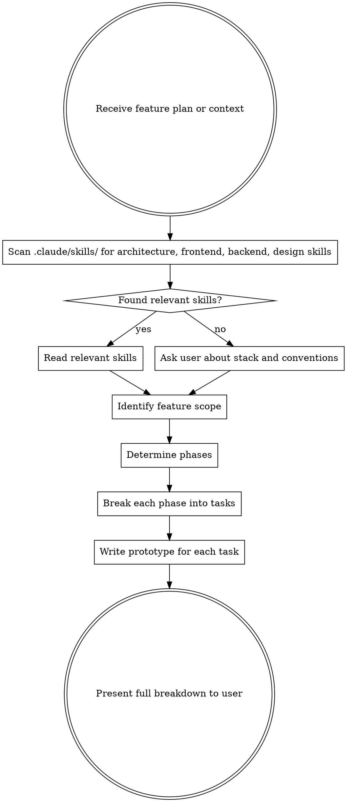

# Feature Breakdown

## Overview

Transforms a feature plan into concrete phases and tasks using divide-and-conquer. Each task includes a code prototype aligned to the project's actual conventions. Never implements — only structures the work and shows what needs to be built.

## Iron Rules

- **ALWAYS read available skills first** to understand the project's architecture, language, and design conventions before producing any output.
- **NEVER invent architecture.** Prototypes must reflect the conventions found in skills or confirmed by the user.
- **NEVER implement.** Prototypes are illustrative — they show shape and intent, not final code.
- **Tasks must be small enough** to be completed in a single focused session.

## Process



## Step 1 — Read the Project's Skills

Before producing any output, scan `.claude/skills/` for skills that describe:

- Backend architecture (domain model, service layer, repository pattern, API conventions)
- Frontend architecture (component structure, state management, routing)
- Database or storage conventions
- Testing conventions
- Any design system or UI library in use

Read every relevant skill. If none exist, ask the user:
1. What language and framework are used?
2. How is the codebase structured (layers, modules, folders)?
3. Are there naming or architectural conventions to follow?

## Step 2 — Identify Feature Scope and Size

Classify the feature before dividing it:

| Size | Signal | Typical Phases |
|------|--------|----------------|
| Small | Single domain, no UI or no API | 1 phase, 2–4 tasks |
| Medium | Full-stack or multi-domain | 2–3 phases, 3–5 tasks each |
| Large | Multiple bounded contexts, integrations | 3+ phases, prioritized sequencing |

## Step 3 — Determine Phases

Phases represent independent scopes of work. Each phase should be completable and testable on its own.

**Common phase separations:**
- Frontend / Backend
- Domain A / Domain B (e.g., Orders / Inventory)
- Core logic / Integrations / UI
- Data layer / Service layer / API layer

Name phases clearly: `Phase 1 — Backend: Domain Model`, `Phase 2 — API`, `Phase 3 — Frontend`.

**Phase ordering rules:**
- Phases with no dependencies come first
- Shared contracts (API shapes, interfaces) must be defined before both sides implement them
- Never create circular phase dependencies

## Step 4 — Break Phases into Tasks

Each task must be:
- **Atomic:** one clear deliverable
- **Small:** completable in a single session
- **Named with a verb:** `Create X`, `Implement Y`, `Add Z`
- **Ordered:** later tasks in a phase may depend on earlier ones

## Step 5 — Write a Prototype for Each Task

For each task, produce a code prototype that:
- Follows the conventions found in skills or confirmed by the user
- Shows the shape of the solution (signatures, types, structure) — not the full implementation
- Uses the project's actual language, framework, and naming style
- Is annotated with `// TODO:` comments where the real logic goes

**Prototype must NOT:**
- Be copy-paste ready final code
- Invent patterns not found in existing skills or confirmed conventions
- Include business logic beyond what illustrates the structure

## TDD — Mandatory for Every Task

Every task in the breakdown must be implemented following TDD:

1. **RED** — Write a failing test describing the expected behavior
2. **GREEN** — Write the minimal production code to pass it
3. **REFACTOR** — Improve the code without changing behavior

Add a `**TDD note:**` line to every task describing what the first failing test should assert. This makes the TDD entry point explicit and removes ambiguity about where to start.

Example:
```
### Task 1.1 — Create LoginDto
**What needs to be done:** DTO with email and password fields, validated with class-validator.
**TDD note:** First test asserts that a valid payload passes, and that missing email or empty password fail validation.
```

## Output Format

````markdown
# Breakdown: <Feature Name>

## Overview
One paragraph summarizing the feature and the breakdown strategy.

## Phase 1 — <Phase Name>

### Task 1.1 — <Task Name>
**What needs to be done:** One sentence describing the deliverable.

**Prototype:**
```<language>
// prototype code here
```

### Task 1.2 — <Task Name>
...

## Phase 2 — <Phase Name>
...

## Dependencies & Sequencing
- Phase 2 depends on Phase 1's API contract being defined
- Task 2.3 depends on Task 2.1
- ...

## Open Questions
- Anything unresolved that could affect the breakdown
````

## What NOT to Do

- Do not write complete implementations — only prototypes
- Do not invent architecture not confirmed by skills or the user
- Do not create tasks so large they span multiple sessions
- Do not skip reading existing skills — they define the language of the project
