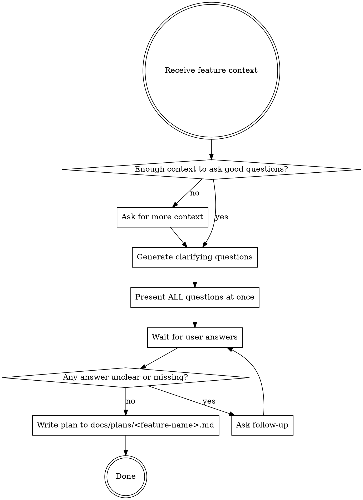

# Feature Planning

## Overview

This skill produces a complete, language-agnostic feature plan by asking clarifying questions first. It never implements anything and never invents requirements — every assumption is confirmed with the user.

## Iron Rules

- **NEVER write code.** No pseudocode, no snippets, no examples.
- **NEVER invent requirements.** If unsure, ask.
- **ALWAYS create `docs/plans/` if it does not exist** before writing the plan file.
- **ALWAYS ask ALL questions before writing the plan.** Do not write the plan mid-conversation.

## Process



## Clarifying Questions Guide

Group questions by category. Only ask what is genuinely unknown. Never ask something the user already answered.

**Scope**
- What problem does this feature solve?
- Who are the users/actors involved?
- What is explicitly OUT of scope?

**Behavior**
- What are the main user flows / happy paths?
- What are the known edge cases or failure scenarios?
- Are there any constraints (performance, security, compliance)?

**Integration**
- Does this touch existing functionality? Which parts?
- Are there external systems, APIs, or services involved?
- Are there dependencies this feature must wait for?

**Acceptance**
- How will we know this feature is done?
- Are there specific acceptance criteria or success metrics?

**Priority / Sequencing**
- Is there a preferred order for implementing the parts?
- Are there phases or milestones?

## Plan File Format

Save to `docs/plans/<kebab-case-feature-name>.md`.

```markdown
# Plan: <Feature Name>

## Problem
What problem this solves and why it matters.

## Goals
Bulleted list of what success looks like.

## Out of Scope
Explicit list of what is NOT included.

## Actors & Context
Who interacts with this feature and in what context.

## User Flows
Numbered steps for each main flow.

## Edge Cases & Failure Scenarios
How the system should behave in non-happy-path situations.

## Acceptance Criteria
Concrete, verifiable conditions for completion.

## Open Questions
Anything still unresolved that must be answered before implementation.

## Implementation Hints (optional)
High-level sequencing suggestions — no code, no tech stack assumptions.
```

## Implementation Approach

Every task produced by this plan **must** be implemented using TDD:

1. **RED** — Write a failing test that describes the behavior
2. **GREEN** — Write the minimal code to make the test pass
3. **REFACTOR** — Clean up without changing behavior

Include this expectation explicitly in the `Implementation Hints` section of every plan. Never assume TDD is implied — state it.

## What NOT to Include in the Plan

- Technology choices (language, framework, database)
- Code snippets or pseudocode
- Invented requirements not confirmed by the user
- Implementation details below the "what needs to happen" level
