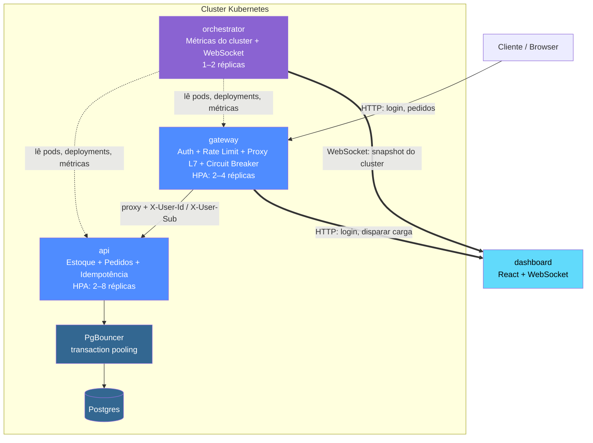
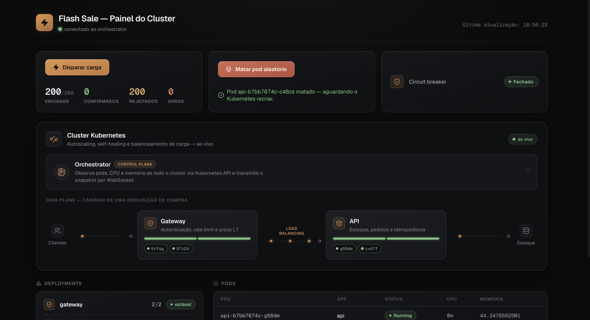

# Flash Sale — Black Friday

> Simulação de flash sale de Black Friday com controle real de concorrência de estoque, rodando em Kubernetes com autoscaling horizontal, balanceamento de carga em duas camadas e um painel em tempo real que mostra o cluster reagindo ao vivo — mate um pod e veja o Kubernetes se autocurar, veja o HPA escalar sob carga, veja estoque e pedidos se atualizarem enquanto requisições concorrentes disputam o último item.

---

## Stack


---

## Sumário

- [Sobre o projeto](#sobre-o-projeto)
- [As duas garantias centrais](#as-duas-garantias-centrais)
- [Arquitetura](#arquitetura)
- [Funcionalidades](#funcionalidades)
- [Stack em detalhe](#stack-em-detalhe)
- [Estrutura do repositório](#estrutura-do-repositório)
- [Documentação completa](#documentação-completa)
- [Como executar](#como-executar)
- [Testes](#testes)
- [CI](#ci)

---

## Sobre o projeto

Este é um projeto de portfólio que simula, de ponta a ponta, o cenário mais estressante de e-commerce que existe: um produto com estoque muito limitado sendo disputado por um pico repentino de requisições concorrentes, como acontece em uma flash sale de Black Friday.

O sistema roda em três serviços de backend (NestJS), um frontend React em tempo real, PostgreSQL atrás de PgBouncer, e é orquestrado por Kubernetes de verdade (Minikube/Kind) — com HPA, RBAC, NetworkPolicy e self-healing, tudo demonstrável ao vivo através de um dashboard que reage ao estado real do cluster via WebSocket.

O objetivo não é só "vender um produto": é provar, com **testes automatizados** — não apenas com uma demonstração ao vivo — que o sistema nunca vende mais do que tem em estoque e nunca duplica um pedido, mesmo sob concorrência real.

## As duas garantias centrais

| Garantia | Como é resolvida |
|---|---|
| **Zero overselling** | Débito de estoque via `UPDATE produtos SET estoque -= :qtd WHERE estoque >= :qtd` — checagem e decremento na mesma instrução atômica, sem janela de tempo entre "checar" e "descontar". |
| **Zero duplicação de pedido** | `INSERT ... ON CONFLICT (idempotency_key) DO NOTHING` — nunca `SELECT` seguido de `INSERT` — combinado com uma chave de idempotência gerada uma vez por sessão de tentativa de compra e um botão de compra desabilitado no primeiro clique. |

Ambas são cobertas por testes de integração dedicados que disparam dezenas de requisições concorrentes reais contra um Postgres real, e rodam no CI a cada push — se alguém remover o `WHERE` do `UPDATE` ou trocar o `ON CONFLICT` por um `SELECT`+`INSERT` numa refatoração futura, o CI quebra imediatamente. Detalhes completos: [documentação de testes](docs/09-testes.md).

## Arquitetura



Balanceamento de carga em duas camadas — **L4** (Service/kube-proxy do Kubernetes) distribui entre réplicas de um mesmo serviço; **L7** (`gateway`) roteia por regra de negócio antes de o tráfego chegar no L4 — e isolamento de rede real via `NetworkPolicy`: só o `gateway` alcança `api`/`orchestrator`, e só `api`/`orchestrator` alcançam o PgBouncer. Diagrama completo e racional de cada decisão: [documentação de arquitetura](docs/01-visao-geral-e-arquitetura.md).

<p align="center">
  
</p>

## Funcionalidades

| Área | O que o sistema faz |
|---|---|
| **Autenticação** | Login com JWT real assinado pelo `gateway` (sem senha — simplificação de MVP declarada); `AuthGuard` valida assinatura e expiração de verdade |
| **Compra concorrente** | `POST /pedidos` com idempotência atômica via `Idempotency-Key`; rejeita corretamente sob falta de estoque (`409`) |
| **Autoscaling** | HPA da `api` (2–8 réplicas) escalando por CPU sob carga real, visível ao vivo no dashboard |
| **Self-healing** | Botão "Matar pod aleatório" remove um pod da `api` via API do Kubernetes — o Kubernetes recria sozinho, sem perder requisições em andamento (graceful shutdown com `preStop` + `SIGTERM`) |
| **Circuit breaker** | Abre após 5 falhas em 10s, meio-abre após 5s, fecha com 1 requisição de teste bem-sucedida — estado refletido ao vivo no painel |
| **Painel em tempo real** | Topologia do cluster, réplicas, CPU/memória por pod, status de cada pod — tudo via WebSocket, atualizado a cada 2s |
| **Geração de carga** | Botão "Disparar carga" no dashboard (ou script k6 dedicado) simula o pico de Black Friday e mostra o HPA reagindo |
| **Isolamento de rede** | `NetworkPolicy` garante que só o `gateway` fala com `api`/`orchestrator`, e só eles falam com o banco — não é só ausência de Ingress |

## Stack em detalhe

### Backend
- **Node.js 20** + **TypeScript** em 100% do código
- **NestJS 10** nos três serviços (`gateway`, `api`, `orchestrator`)
- **TypeORM 0.3** para entidades e migrations versionadas (nunca `synchronize: true`)
- **PostgreSQL 16**, sempre atrás de **PgBouncer** em modo `transaction pooling`
- **`@nestjs/jwt`** para autenticação real (HMAC)
- **`@kubernetes/client-node`** para leitura de pods/deployments/métricas e para o endpoint de matar pod
- **WebSocket puro** (`@nestjs/platform-ws`, sem Socket.IO) para o stream do painel

### Frontend
- **React 18** + **Vite**
- WebSocket nativo do browser para consumir o snapshot do cluster em tempo real
- `lucide-react` para ícones

### Infraestrutura
- **Kubernetes** (Minikube/Kind) — HPA, RBAC, NetworkPolicy, PersistentVolumeClaim
- **Docker Compose** para o ambiente de banco de dados em desenvolvimento local
- **k6** para teste de carga com thresholds que falham a execução sob overselling ou taxa de erro anormal
- **GitHub Actions** — lint + testes unitários + testes de integração (com Postgres real) + build de imagem Docker (sem deploy automatizado)

## Estrutura do repositório

```
flashscale/
├── services/
│   ├── api/            # regras de negócio: estoque, pedidos, idempotência
│   ├── gateway/         # auth (JWT real), rate limit, proxy L7, circuit breaker
│   └── orchestrator/    # métricas do cluster via @kubernetes/client-node + WebSocket
├── dashboard/            # React — painel em tempo real
├── k8s/                   # manifests do Kubernetes
├── tests/
│   ├── unit/
│   ├── integration/       # testes de concorrência — os mais importantes do repo
│   └── load/               # script k6
├── config/                  # eslint + jest
├── docs/                      # documentação técnica completa (ver abaixo)
├── docker-compose.yml
└── .github/workflows/ci.yaml
```

## Documentação completa

A documentação técnica detalhada de cada componente vive em [`docs/`](docs/README.md), dividida em 12 documentos focados:

| Documento | Conteúdo |
|---|---|
| [1. Visão geral e arquitetura](docs/01-visao-geral-e-arquitetura.md) | O projeto, roteiro de demo, arquitetura das três camadas, stack, estrutura de pastas |
| [2. Serviço `api`](docs/02-servico-api.md) | Estoque, pedidos, idempotência, migrations |
| [3. Serviço `gateway`](docs/03-servico-gateway.md) | Autenticação JWT, proxy L7, circuit breaker |
| [4. Serviço `orchestrator`](docs/04-servico-orchestrator.md) | Leitura do cluster, WebSocket, matar pod |
| [5. Dashboard](docs/05-dashboard.md) | Componentes React, hooks, disparo de carga |
| [6. Banco de dados e PgBouncer](docs/06-banco-de-dados-e-pgbouncer.md) | Schema, constraints, connection pooling |
| [7. Kubernetes](docs/07-kubernetes.md) | ConfigMap, Secrets, Deployments, HPA, NetworkPolicy, RBAC |
| [8. Segurança](docs/08-seguranca.md) | Modelo de confiança de ponta a ponta |
| [9. Testes](docs/09-testes.md) | Concorrência, unitários, carga (k6) |
| [10. CI/CD e Docker](docs/10-cicd-e-docker.md) | Pipeline do GitHub Actions, Dockerfiles |
| [11. Fluxos completos](docs/11-fluxos-completos.md) | Diagramas de sequência de cada cenário |
| [12. Trade-offs e como rodar](docs/12-trade-offs-e-como-rodar.md) | Limitações aceitas + guia de execução |

## Como executar

### Pré-requisitos

- Node.js 20+ e npm
- Docker + Docker Compose
- Minikube ou Kind (opcional, só para o cenário completo em Kubernetes)
- k6 (opcional, para teste de carga via linha de comando)

### Variáveis de ambiente

- `.env.example` é o template versionado do ambiente de dev — copie para `.env` (gitignorado, nunca committe) e ajuste `JWT_SECRET` antes de rodar os serviços.
- `.env.test` já vem pronto e é usado automaticamente pelo `npm run test:integration` — aponta para um Postgres/PgBouncer de teste isolados (porta `6433`, banco `flashscale_test`), então os testes nunca tocam o banco de dev. Não precisa copiar nem editar.

```bash
cp .env.example .env       # ajuste JWT_SECRET com um valor forte

npm install
npm run docker:up          # Postgres + PgBouncer locais
npm run migration:run

# em 3 terminais separados:
npm run start:dev              # api        → :3001
npm run start:gateway:dev      # gateway    → :3000
npm run start:orchestrator:dev # orchestrator → :3002

npm run dashboard:install
npm run dashboard:dev           # → http://localhost:5173
```

### Modo completo — com Kubernetes local

Guia passo a passo completo, incluindo build de imagens no Minikube, secrets, ordem de aplicação dos manifests e validação de cada garantia (HPA escalando, self-healing, NetworkPolicy, circuit breaker): [documento 12 — Trade-offs e como rodar](docs/12-trade-offs-e-como-rodar.md).

## Testes

```bash
npm run lint                # eslint — gateway/api/orchestrator
npm run test:unit           # testes unitários
npm run test:integration    # testes de concorrência — os mais importantes do repo
npm run test:load           # k6 (exige gateway/api já rodando)

npm run dashboard:test       # testes do dashboard
```

Detalhes de cada suíte de teste: [documento 9 — Testes](docs/09-testes.md).

## CI

Pipeline no GitHub Actions (`.github/workflows/ci.yaml`), rodando em todo push/PR: lint → testes unitários + testes de integração (com Postgres real de serviço) → build TypeScript + build das três imagens Docker (sem push, sem deploy automatizado — o cluster alvo é local e efêmero). Detalhes: [documento 10 — CI/CD e Docker](docs/10-cicd-e-docker.md).
