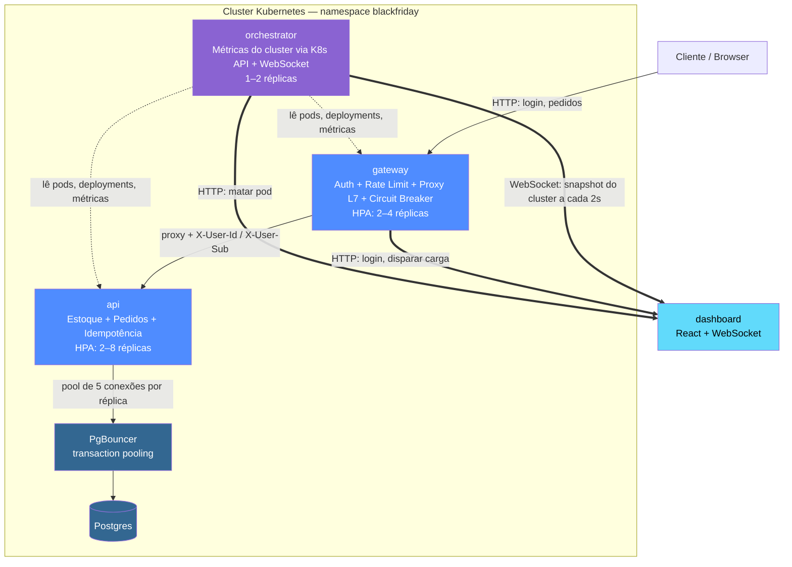

# 1. Visão geral e arquitetura

[← Voltar ao índice](README.md)

## 1.1 O que é este projeto

Este projeto simula uma **flash sale de Black Friday** — um cenário em que um produto com estoque muito limitado recebe um pico repentino de tentativas de compra simultâneas — rodando de verdade em cima de Kubernetes, com autoscaling horizontal, balanceamento de carga em duas camadas e um painel (dashboard) que mostra o cluster reagindo **ao vivo**.

O objetivo central não é só "vender um produto": é provar, com testes automatizados e não apenas com uma demonstração ao vivo, duas garantias que qualquer sistema de e-commerce real precisa ter sob concorrência:

- **Zero overselling**: nunca vender mais unidades do que existem em estoque, mesmo quando dezenas de requisições chegam ao mesmo tempo tentando comprar a última unidade.
- **Zero duplicação de pedido**: um clique duplo do usuário, ou um retry automático de rede após um timeout, nunca deve gerar dois pedidos cobrando duas vezes a mesma unidade.

### Roteiro de demonstração

1. O usuário faz "login" informando apenas um nome (não há senha — simplificação de MVP declarada, não uma falha escondida) e recebe de volta um JWT real, assinado pelo serviço `gateway`.
2. O usuário (ou um script de carga) dispara múltiplas requisições concorrentes de compra contra um produto com estoque baixo, simulando o pico de Black Friday.
3. O painel do `orchestrator` mostra em tempo real: quantas réplicas cada serviço tem, uso de CPU/memória por pod, e pods sendo criados pelo HPA (Horizontal Pod Autoscaler) conforme a carga sobe.
4. Um botão "Matar pod aleatório" remove um pod da `api` diretamente via API do Kubernetes — o painel mostra o pod sumir e o Kubernetes recriá-lo sozinho (self-healing), sem que nenhuma requisição em andamento seja perdida (graceful shutdown).
5. Ao final, o painel mostra quantos pedidos foram aceitos, quantos foram rejeitados por falta de estoque, e o estoque final — e dois testes de integração automatizados provam matematicamente que não houve overselling nem duplicação, em vez de essa garantia depender só de "funcionou na demo ao vivo".

### Por que este projeto existe

É um projeto de portfólio desenhado para mostrar competência prática em: modelagem de concorrência em banco de dados relacional (não só teoria), operação real de Kubernetes (HPA, RBAC, NetworkPolicy, self-healing, graceful shutdown), design de API resiliente (circuit breaker, timeouts, idempotência), e construção de um frontend que visualiza infraestrutura viva via WebSocket — algo mais raro e mais forte, como prova de competência, do que qualquer print estático de terminal.

## 1.2 Arquitetura geral

O sistema é dividido em três serviços de backend (todos em NestJS/Node.js), um frontend React, um banco de dados PostgreSQL atrás de um pooler de conexões (PgBouncer), e a camada de orquestração do próprio Kubernetes.



**NetworkPolicy garante, em nível de infraestrutura, dois estrangulamentos de tráfego:** só o `gateway` pode chamar `api`/`orchestrator` diretamente, e só `api`/`orchestrator` podem chamar o PgBouncer (que por sua vez é o único que fala com o Postgres). Isso é detalhado no documento [7 — Kubernetes](07-kubernetes.md#77-networkpolicy--isolamento-de-rede).

### As três camadas do backend

- **`gateway`** (porta padrão 3000, HPA 2–4 réplicas): é o único ponto de entrada público. Faz autenticação (emite e valida JWT), rate limiting, faz proxy HTTP em nível de aplicação (camada L7) para a `api`, e mantém um circuit breaker que protege o sistema quando a `api` está falhando. Detalhes completos: [documento 3](03-servico-gateway.md).
- **`api`** (porta padrão 3001, HPA 2–8 réplicas): concentra toda a regra de negócio — cálculo e débito de estoque, criação de pedidos, verificação de idempotência. É o serviço que mais escala, porque é ele quem recebe o volume real de tentativas de compra. Detalhes completos: [documento 2](02-servico-api.md).
- **`orchestrator`** (porta padrão 3002, 1–2 réplicas, sem HPA): não participa do fluxo de compra. Sua única responsabilidade é ler o estado do cluster Kubernetes (pods, deployments, métricas de CPU/memória via `metrics-server`) usando a biblioteca oficial `@kubernetes/client-node`, e empurrar esse estado por WebSocket para o dashboard. Também expõe o endpoint que mata um pod aleatório da `api`. Detalhes completos: [documento 4](04-servico-orchestrator.md).

### Por que o gateway também tem HPA

Numa primeira versão ingênua deste projeto, só a `api` escalava. Isso tornava o `gateway` — que é o único ponto de entrada — o gargalo real do sistema mesmo com a `api` escalando até 8 réplicas: não adianta ter 8 réplicas de `api` se só 1 ou 2 réplicas de `gateway` conseguem empurrar tráfego para elas. Por isso o `gateway` também escala (2 a 4 réplicas), e isso serve como um segundo exemplo, na demonstração, de "camadas que escalam de forma independente".

**Limitação conhecida e aceita, não escondida:** o HPA do `gateway` escala por percentual de uso de CPU — a métrica padrão e mais simples do Kubernetes. Mas o trabalho do `gateway` é majoritariamente fazer proxy HTTP e validar assinatura de JWT: é um trabalho leve de CPU e predominantemente limitado por I/O (esperar a resposta da `api`). Isso significa que o `gateway` pode estar com uma fila grande de conexões pendentes e, ainda assim, CPU baixa — e o HPA não dispara na hora certa. Isso não invalida a decisão (HPA impreciso ainda é estritamente melhor do que nenhum HPA), mas é uma limitação declarada, não uma solução perfeita. A evolução natural seria uma métrica customizada de "requisições em voo" via Prometheus Adapter — fora do escopo deste MVP.

### Load balancing em duas camadas

O sistema distribui carga em dois níveis distintos, e essa distinção é intencional e vale a pena entender:

- **L4 (camada de transporte, via `Service`/`kube-proxy` do Kubernetes):** cada `Service` do Kubernetes (ex.: `Service` da `api`) distribui requisições TCP entre todas as réplicas saudáveis daquele Deployment, de forma cega ao conteúdo da requisição — só olha IP e porta.
- **L7 (camada de aplicação, dentro do `gateway`):** o `gateway` decide, olhando o conteúdo da requisição HTTP (rota, método, regra de negócio), para onde encaminhar cada chamada antes mesmo dela chegar no balanceamento L4 da `api`.

## 1.3 Stack tecnológica

- **Runtime:** Node.js 20 (fixado no CI e nos `Dockerfile`s como `node:20-alpine`).
- **Linguagem:** TypeScript em 100% do código de backend e frontend.
- **Framework de backend:** [NestJS](https://nestjs.com/) 10.x — um framework opinativo sobre Express que organiza código em módulos, controllers, providers (serviços) injetáveis via um container de Injeção de Dependência.
- **ORM:** [TypeORM](https://typeorm.io/) 0.3.x — usado tanto para mapear entidades (`Produto`, `Pedido`) quanto para rodar migrations versionadas.
- **Banco de dados:** PostgreSQL 16 (imagem `postgres:16-alpine`), sempre acessado através do **PgBouncer** (`edoburu/pgbouncer:1.21.0-p2`) em modo `transaction pooling`.
- **Driver de banco:** `pg` (driver nativo do Postgres para Node.js), usado por baixo do TypeORM.
- **Autenticação:** `@nestjs/jwt`, que por sua vez usa a biblioteca `jsonwebtoken` para assinar e verificar tokens JWT reais (HMAC com segredo compartilhado).
- **HTTP client interno:** `@nestjs/axios` (wrapper reativo sobre `axios`), usado pelo `gateway` para fazer proxy de requisições até a `api`.
- **WebSocket:** `@nestjs/websockets` com o adapter `@nestjs/platform-ws` (WebSocket puro via biblioteca `ws`, **sem** Socket.IO) — escolhido deliberadamente para permitir conectar com um cliente WebSocket genérico (como `wscat`) sem depender de um protocolo proprietário por cima do WebSocket.
- **Cliente Kubernetes:** `@kubernetes/client-node` (biblioteca oficial mantida pela comunidade Kubernetes para Node.js) — usada pelo `orchestrator` para ler pods, deployments e métricas, e para deletar pods.
- **Validação de entrada:** `class-validator` + `class-transformer`, plugados no `ValidationPipe` global do NestJS em cada serviço.
- **Frontend:** React 18+ com Vite como bundler/dev server, e WebSocket nativo do browser (`window.WebSocket`) para consumir o stream do `orchestrator`.
- **Ícones do dashboard:** biblioteca `lucide-react`.
- **Testes de unidade e integração:** Jest + `ts-jest`, com `supertest` para testes HTTP contra uma instância real do NestJS subida em memória.
- **Teste de carga:** [k6](https://k6.io/), com thresholds que **falham a execução** do script se detectarem taxa de erro anormal ou mais pedidos confirmados do que o estoque inicial.
- **Lint:** ESLint 10 com `typescript-eslint`, configuração única compartilhada (`config/eslint.config.mjs`) cobrindo os três serviços de backend e a pasta de testes.
- **CI:** GitHub Actions — só lint, testes e build de imagem Docker (sem push, sem deploy automatizado).
- **Orquestração:** Kubernetes, pensado para rodar localmente em Minikube ou Kind (não depende de nada específico de cloud, exceto o `metrics-server`, que precisa ser habilitado à parte).

## 1.4 Estrutura de pastas

```
flashscale/
├── services/
│   ├── api/                  # regras de negócio: estoque, pedidos, idempotência
│   │   ├── src/
│   │   │   ├── pedidos/      # módulo de pedidos (controller, service, domain, dto, entity)
│   │   │   ├── produtos/     # módulo de produtos/estoque
│   │   │   ├── common/       # RepositoryAdapter genérico
│   │   │   ├── config/       # configuração da conexão TypeORM
│   │   │   ├── migrations/   # migrations versionadas do TypeORM
│   │   │   ├── app.module.ts
│   │   │   └── main.ts
│   │   └── Dockerfile
│   ├── gateway/               # auth (JWT real), rate limit, proxy L7, circuit breaker
│   │   ├── src/
│   │   │   ├── auth/          # login, guard, JWT
│   │   │   ├── circuit-breaker/
│   │   │   ├── proxy/         # encaminhamento HTTP pra api
│   │   │   ├── app.module.ts
│   │   │   └── main.ts
│   │   └── Dockerfile
│   └── orchestrator/          # métricas do cluster via @kubernetes/client-node + WebSocket
│       ├── src/
│       │   ├── cluster/       # service, gateway (WS), controller de kill-pod, utils
│       │   ├── app.module.ts
│       │   └── main.ts
│       └── Dockerfile
├── dashboard/                  # React — painel em tempo real
│   └── src/
│       ├── components/         # TopologyView, DeploymentsPanel, PodsList, KillPodPanel, LoadTestPanel, CircuitBreakerPanel
│       ├── hooks/               # use-cluster-snapshot (WebSocket), use-circuit-breaker-status (polling)
│       ├── load/                 # load-dispatcher: dispara carga real do browser
│       ├── purchase/             # PurchaseAttemptSession, BuyButtonGuard
│       ├── types/                # espelho local do contrato ClusterSnapshot
│       ├── App.tsx
│       └── main.tsx
├── k8s/                          # manifests do Kubernetes
│   ├── namespace.yaml
│   ├── configmap.yaml
│   ├── secrets.example.yaml     # template versionado, sem valores reais
│   ├── secrets.yaml               # real, gitignored, nunca commitado
│   ├── rbac.yaml                   # ServiceAccount + Role + RoleBinding do orchestrator
│   ├── networkpolicy-api.yaml
│   ├── networkpolicy-orchestrator.yaml
│   ├── networkpolicy-postgres.yaml # cobre postgres E pgbouncer
│   ├── deployment-api.yaml
│   ├── deployment-gateway.yaml
│   ├── deployment-postgres.yaml
│   ├── deployment-pgbouncer.yaml
│   ├── service-api.yaml
│   ├── service-gateway.yaml
│   ├── service-postgres.yaml
│   ├── service-pgbouncer.yaml
│   ├── hpa-api.yaml
│   └── postgres-pvc.yaml
├── tests/
│   ├── unit/                     # testes unitários por serviço (gateway, orchestrator, dashboard)
│   ├── integration/                # testes de concorrência (os mais importantes do repo) + auth/proxy/circuit breaker
│   └── load/                        # script k6
├── config/                          # eslint + jest (unit e integration)
├── docker-compose.yml                # Postgres + Postgres de teste + PgBouncer (dev local)
├── .github/workflows/ci.yaml
├── tsconfig.json / tsconfig.build.json  # tsconfig na raiz do repo (não em cada serviço)
└── package.json                          # um único package.json/node_modules pra toda a monorepo de backend
```

**Observação estrutural importante:** os três serviços de backend (`api`, `gateway`, `orchestrator`) e a pasta `tests/` compartilham um único `package.json`, um único `tsconfig.json` e um único `node_modules` na raiz do repositório — não é um monorepo com múltiplos `package.json` (estilo Lerna/Nx/Turborepo). Só o `dashboard/` tem seu próprio `package.json` e `node_modules` independentes, porque é um projeto Vite/React separado com dependências de frontend que não fazem sentido no backend.

---

[← Voltar ao índice](README.md) · [Próximo: Serviço `api` →](02-servico-api.md)
