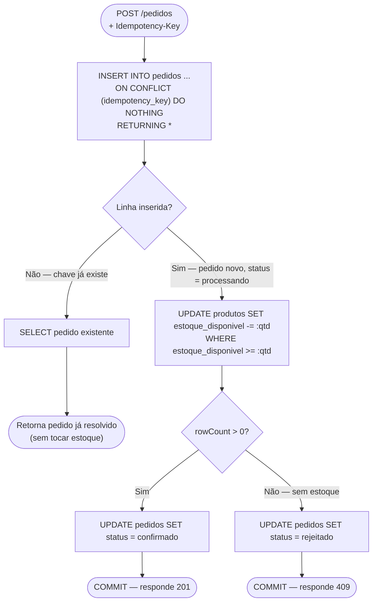

# 2. Serviço `api`

[← Voltar ao índice](README.md)

Responsável por toda a regra de negócio: cadastro/consulta de produtos, cálculo e débito de estoque, criação de pedidos e a garantia de idempotência. É o único serviço que fala diretamente com o schema de negócio do banco de dados (a tabela de produtos e a de pedidos). Roda na porta padrão `3001`, com HPA entre 2 e 8 réplicas.

## 2.1 Arquitetura interna do módulo `produtos`

O módulo `produtos` é propositalmente enxuto: existe só para expor a entidade `Produto` e a operação atômica de débito de estoque para quem precisar dela (hoje, só o módulo `pedidos`).

- **Entidade `Produto`** (`produtos/entities/produto.entity.ts`): mapeia a tabela `produtos`. Colunas: `id` (UUID, gerado pelo Postgres via `gen_random_uuid()`), `nome` (varchar), `estoque_disponivel` (inteiro), `created_at`/`updated_at` (timestamps automáticos do TypeORM).
- **`ProdutosDomain`** (`produtos/produtos.domain.ts`): estende um `RepositoryAdapter<Produto>` genérico (ver seção 2.4) e expõe o único método realmente crítico do módulo: `debitarEstoque(produtoId, quantidade, manager?)`.

O coração da garantia de "zero overselling" está aqui, em uma única instrução SQL:

```sql
UPDATE produtos
SET estoque_disponivel = estoque_disponivel - :quantidade, updated_at = now()
WHERE id = :produtoId AND estoque_disponivel >= :quantidade
RETURNING id;
```

Isso é executado via `manager.query()` bruto (não pelo `save()` do TypeORM), porque o TypeORM, ao atualizar uma entidade normalmente, faria primeiro um `SELECT` para carregar a linha e depois um `UPDATE` — dois passos separados, com uma janela de tempo entre eles onde outra transação concorrente poderia ler o mesmo valor de estoque antes do primeiro `UPDATE` ser commitado. O `WHERE estoque_disponivel >= :quantidade` faz a checagem de disponibilidade **e** o decremento acontecerem atomicamente, na mesma instrução, protegidos pelas garantias de isolamento do próprio Postgres — não existe janela de tempo entre "checar se tem estoque" e "descontar o estoque" porque são a mesma operação.

Se a cláusula `WHERE` não bater (ou seja, `estoque_disponivel < quantidade` no momento exato da execução), o `UPDATE` afeta zero linhas — `rowCount = 0` — e o método retorna `false`, sinalizando ao chamador que o pedido deve ser rejeitado por falta de estoque, sem nunca deixar `estoque_disponivel` ficar negativo.

## 2.2 Arquitetura interna do módulo `pedidos`

Este é o módulo mais importante do serviço, e está dividido em camadas explícitas para separar responsabilidades:

- **`PedidosController`** (`pedidos.controller.ts`): expõe `POST /pedidos`. Lê o header `Idempotency-Key` da requisição (rejeita com `400 Bad Request` se ele estiver ausente — a idempotência não é opcional, é um contrato obrigatório do endpoint) e delega para a camada de aplicação. Define o código de resposta HTTP dinamicamente: `201 Created` se o pedido foi confirmado, `409 Conflict` se foi rejeitado (por falta de estoque, ou porque já existia um pedido com essa mesma chave).
- **`PedidosApplication`** (`pedidos.application.ts`): uma camada fininha entre o controller e o service — hoje só traduz o DTO recebido em um input interno (`produtoId`, `quantidade`, `idempotencyKey`) e chama o `PedidosService`. Existe como ponto de extensão caso, no futuro, seja preciso orquestrar múltiplos serviços de domínio para uma mesma operação de "criar pedido" sem inchar o controller.
- **`PedidosService`** (`pedidos.service.ts`): é onde a transação de banco de dados inteira acontece. Ver o fluxo detalhado na seção 2.3.
- **`PedidosDomain`** (`pedidos.domain.ts`): estende `RepositoryAdapter<Pedido>` e expõe as duas operações atômicas sobre a tabela `pedidos`: `inserirComIdempotencia` e `atualizarStatus`.
- **`Pedido`** (entidade): mapeia a tabela `pedidos`. Colunas: `id` (UUID), `idempotency_key` (varchar único), `produto_id` (UUID, FK para `produtos`), `quantidade` (inteiro), `status` (varchar — ver enum abaixo), `created_at`/`updated_at`.
- **`StatusPedido`** (enum): três valores possíveis — `processando` (estado transitório, entre o INSERT e a resolução do débito de estoque, dentro da mesma transação), `confirmado` (estoque debitado com sucesso) e `rejeitado` (sem estoque suficiente no momento da tentativa).
- **`CreatePedidoDto`**: valida a entrada do `POST /pedidos` — `produtoId` precisa ser um UUID válido (`@IsUUID()`), `quantidade` precisa ser um inteiro maior ou igual a 1 (`@IsInt() @Min(1)`).
- **`PedidoMapper`**: função estática pura que converte a entidade `Pedido` (modelo interno, com todos os campos de persistência) no `PedidoResponseDto` (contrato exposto pela API — mesmos campos relevantes, mas desacoplado da entidade para não vazar detalhes de implementação do banco na resposta HTTP).

## 2.3 O fluxo transacional completo de `criarPedido`

Todo o processo abaixo acontece dentro de **uma única transação de banco de dados** (`dataSource.transaction(async manager => { ... })`), garantindo que, se qualquer passo falhar, nada é persistido parcialmente:



1. **Inserção idempotente do pedido.** A `PedidosDomain.inserirComIdempotencia` executa:
   ```sql
   INSERT INTO pedidos (idempotency_key, produto_id, quantidade, status)
   VALUES (:key, :produtoId, :quantidade, 'processando')
   ON CONFLICT (idempotency_key) DO NOTHING
   RETURNING *;
   ```
   Se a linha for retornada (`inseridos.length > 0`), significa que esta é a primeira vez que essa `idempotency_key` é vista — o pedido acabou de ser criado com status `processando`, e o fluxo segue para o passo 2.

   Se **nenhuma** linha for retornada, significa que já existe um pedido com essa chave (seja porque o cliente reenviou a mesma requisição após um timeout de rede, seja porque duas requisições concorrentes com a mesma chave chegaram ao mesmo tempo). Nesse caso, a função faz um `SELECT` do pedido já existente e o devolve — **sem tocar no estoque de novo**. Isso é o que torna toda a operação `criarPedido` naturalmente idempotente por baixo, mesmo sob concorrência real com a mesma chave.

   **Por que `ON CONFLICT DO NOTHING` e não `SELECT` seguido de `INSERT`:** se a verificação "essa chave já existe?" fosse feita com um `SELECT` e, só se ele voltasse vazio, um `INSERT` separado, então duas requisições concorrentes chegando com a **mesma** chave (por exemplo, duas cópias do mesmo retry de rede, disparadas quase ao mesmo tempo) poderiam ambas passar pelo `SELECT` antes que qualquer uma das duas tivesse terminado seu `INSERT` — e as duas acabariam inserindo, reintroduzindo exatamente a mesma classe de race condition que o `UPDATE` atômico do estoque foi desenhado para evitar. O `INSERT ... ON CONFLICT ... DO NOTHING` delega essa exclusão mútua para a constraint `UNIQUE (idempotency_key)` do próprio Postgres, que é atômica por definição — não existe janela de tempo entre "checar" e "inserir" porque são a mesma operação.

2. **Débito de estoque — só se o pedido acabou de ser criado.** Se (e somente se) o passo 1 realmente inseriu uma linha nova (`criado === true`), o `PedidosService` chama `ProdutosDomain.debitarEstoque` (o `UPDATE` atômico descrito na seção 2.1), passando o mesmo `manager` da transação em andamento — para que o débito de estoque e a criação do pedido sejam parte da mesma unidade atômica.

3. **Atualização do status final, ainda na mesma transação.** Se o débito de estoque retornou `true`, o pedido recebe o status `confirmado`; se retornou `false` (estoque insuficiente), recebe `rejeitado`. Essa atualização também acontece dentro da mesma transação, então o pedido nunca fica visivelmente preso em `processando` para outra transação concorrente que tente ler essa mesma linha.

4. **Retorno para uma chave repetida.** Se o passo 1 detectou que a chave já existia (`criado === false`), o fluxo pula direto para o retorno do pedido já existente — nenhum novo débito de estoque é feito, então retentativas de rede (ou dois cliques do usuário, se a chave for a mesma sessão de compra) nunca cobram duas vezes.

## 2.4 Endpoint de compra — contrato exato

`POST /pedidos`
- **Headers obrigatórios:** `Idempotency-Key` (qualquer string, tipicamente um UUID gerado pelo cliente).
- **Body:** `{ "produtoId": "<uuid>", "quantidade": <inteiro >= 1> }`.
- **Resposta `201 Created`:** pedido confirmado, com o corpo `{ id, produtoId, quantidade, status: "confirmado", idempotencyKey, createdAt }`.
- **Resposta `409 Conflict`:** pedido rejeitado — tanto por falta de estoque quanto por reenvio de uma chave já processada e cujo desfecho final não foi `confirmado`. O corpo tem o mesmo formato, com `status: "rejeitado"`.
- **Resposta `400 Bad Request`:** header `Idempotency-Key` ausente, ou corpo inválido (`produtoId` não é UUID, `quantidade` não é inteiro ≥ 1).

## 2.5 `RepositoryAdapter` — abstração compartilhada

`common/repository-adapter.ts` define uma classe abstrata genérica `RepositoryAdapter<T extends { id: string }>` que ambos os domains (`ProdutosDomain`, `PedidosDomain`) estendem. Ela resolve um problema específico do TypeORM dentro de transações: cada operação de banco precisa rodar contra o `EntityManager` **da transação em andamento**, não contra o `EntityManager` global do módulo — senão a operação aconteceria fora da transação e quebraria a atomicidade.

O método `protected manager(manager?: EntityManager)` centraliza essa escolha: se um `manager` de transação foi passado explicitamente, usa ele; senão, cai de volta para o `manager` padrão do repositório (usado em contextos fora de transação, como testes que só querem inserir dados de setup). Também expõe `findById` e `create` genéricos, reaproveitáveis por qualquer entidade futura sem duplicar esse cuidado.

## 2.6 Migrations

TypeORM migrations, versionadas como arquivos `.ts` em `services/api/src/migrations/`, cada uma com um timestamp no nome que define a ordem de execução:

1. **`1700000000000-create-produtos-table.ts`**: habilita a extensão `pgcrypto` (necessária para `gen_random_uuid()`) e cria a tabela `produtos`, com uma `CHECK (estoque_disponivel >= 0)` no nível do banco — uma segunda linha de defesa contra estoque negativo, além do `UPDATE` atômico da aplicação.
2. **`1700000000001-create-pedidos-table.ts`**: cria a tabela `pedidos`, com `idempotency_key` como `UNIQUE`, `produto_id` como chave estrangeira para `produtos`, `quantidade` com `CHECK (quantidade > 0)`, e um índice extra em `produto_id` (consultas futuras por produto não precisam de full table scan).
3. **`1700000000002-seed-produto-carga.ts`**: insere (com `ON CONFLICT (id) DO NOTHING`, então é seguro rodar mais de uma vez) um produto de demonstração com um UUID fixo e conhecido (`11111111-1111-4111-8111-111111111111`) e 500 unidades de estoque. Esse produto existe especificamente para o botão "Disparar carga" do dashboard e para o script k6 terem, sempre, um `produtoId` real e já existente contra o qual disparar requisições — sem essa seed, `POST /pedidos` falharia por violação da chave estrangeira assim que o dashboard tentasse comprar um produto inexistente.

Migrations rodam via `npm run migration:run` (que invoca `typeorm-ts-node-commonjs migration:run` apontando para `services/api/src/config/data-source.ts`), nunca via `synchronize: true` — rodar com `synchronize: true` deixaria o TypeORM alterar o schema automaticamente a partir das entidades, o que é conveniente em prototipagem mas perigoso e imprevisível em qualquer ambiente que simule produção (pode até derrubar dados existentes sem aviso).

## 2.7 Configuração da conexão (`config/data-source.ts`)

Define as `DataSourceOptions` do TypeORM, lidas de variáveis de ambiente (`DB_HOST`, `DB_PORT`, `DB_USER`, `DB_PASSWORD`, `DB_NAME`, com defaults sensatos para desenvolvimento local). Dois detalhes não óbvios, ambos em `extra`:

- **`max: 5`** — o tamanho do pool de conexões por réplica da `api`. Com até 8 réplicas rodando ao mesmo tempo (o teto do HPA), isso soma no máximo `8 × 5 = 40` conexões simultâneas chegando ao PgBouncer — dimensionado deliberadamente pequeno por réplica porque é o PgBouncer, não o Postgres, que absorve esse volume e o multiplexa para um número bem menor de conexões físicas reais no banco. Detalhes completos sobre o PgBouncer: [documento 6](06-banco-de-dados-e-pgbouncer.md).
- **`prepare: false`** — desliga prepared statements no driver `pg`. Isso é necessário porque o PgBouncer, em modo `transaction pooling`, pode reatribuir a mesma conexão lógica do cliente a conexões físicas diferentes do Postgres entre uma transação e outra. Prepared statements nomeados ficam fisicamente amarrados a uma conexão específica; sem desabilitá-los, a aplicação sofreria erros intermitentes e difíceis de reproduzir exatamente sob a carga concorrente que este projeto existe para demonstrar.

## 2.8 Bootstrap (`main.ts`)

Sobe a aplicação NestJS, aplica um `ValidationPipe` global com `whitelist: true` (remove campos não declarados no DTO da requisição, ao invés de rejeitá-la) e `transform: true` (converte tipos primitivos automaticamente, ex.: string vinda do JSON para o tipo declarado no DTO), chama `app.enableShutdownHooks()` (necessário para o NestJS reagir a `SIGTERM` e fechar conexões de banco de forma limpa antes de o processo morrer — a base do graceful shutdown descrito no [documento 7](07-kubernetes.md#76-graceful-shutdown--como-as-peças-se-encaixam)), e escuta na porta `process.env.PORT ?? 3001`.

---

[← Anterior: Visão geral](01-visao-geral-e-arquitetura.md) · [Voltar ao índice](README.md) · [Próximo: Serviço `gateway` →](03-servico-gateway.md)
