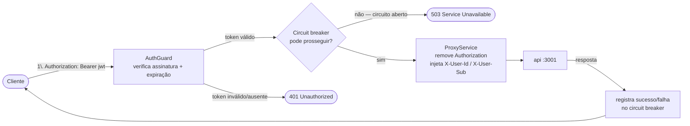
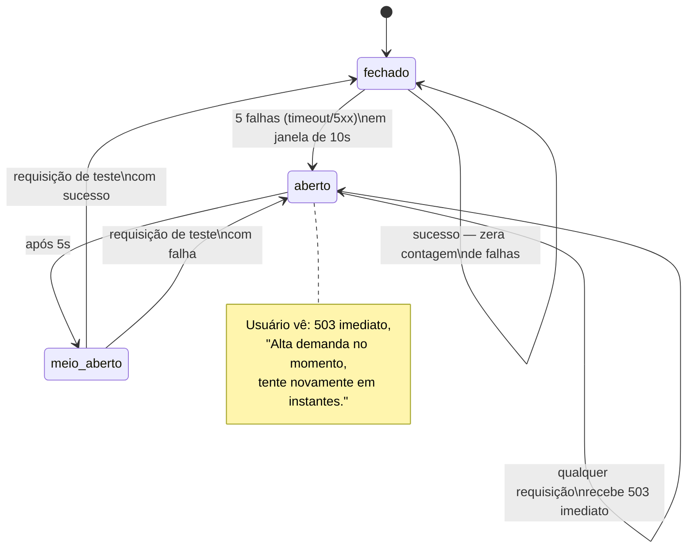

# 3. Serviço `gateway`

[← Voltar ao índice](README.md)

É o único ponto de entrada público do sistema, na porta padrão `3000`, com HPA entre 2 e 4 réplicas. Faz três coisas: autentica quem entra, decide se deixa a requisição passar adiante (circuit breaker) e, se deixar, encaminha a requisição para a `api` (proxy L7), reescrevendo os headers de identidade pelo caminho.

## 3.1 Autenticação (`auth/`)

- **`POST /auth/login`** (`auth.controller.ts`, marcado com o decorator `@Public()` para não exigir um token que ainda não existe): recebe só `{ "nome": "<string>" }` — validado por `LoginDto` (`@IsString() @IsNotEmpty()`). Não existe conceito de senha nem de tabela de usuários no MVP; isso é uma simplificação deliberada e declarada, não uma falha de segurança escondida.
- **`AuthService.login`** (`auth.service.ts`): monta um `JwtPayload` com dois campos — `sub` (o próprio nome informado) e `id` (um UUID gerado com `crypto.randomUUID()`, único por sessão de login) — e assina um JWT real com `JwtService.sign()`, usando o segredo configurado (`JWT_SECRET`, obrigatoriamente vindo de uma variável de ambiente; a aplicação lança um erro na inicialização se essa variável não existir — nunca há um segredo hardcoded de fallback). O token expira em `JWT_EXPIRES_IN` (padrão `15m`).
- **`AuthGuard`** (`auth.guard.ts`): registrado globalmente como `APP_GUARD` no `AuthModule`, então roda automaticamente antes de **qualquer** handler de **qualquer** controller do `gateway`, a menos que o handler (ou a classe inteira) esteja marcado com o decorator `@Public()`. Extrai o token do header `Authorization: Bearer <token>`, chama `jwtService.verifyAsync()` (que checa assinatura **e** expiração), e anexa o payload decodificado como `request.user`. Se o token estiver ausente, mal formado, com assinatura inválida ou expirado, lança `UnauthorizedException` (`401`).
- **`@Public()`** (`public.decorator.ts`): um decorator baseado em `SetMetadata` que marca rotas isentas do `AuthGuard` — usado em `POST /auth/login` e em `GET /circuit-breaker/status` (o dashboard consulta o estado do circuito direto do browser, sem precisar estar autenticado, pela mesma razão prática que o login não exige senha: é um painel de observabilidade, não uma rota de negócio).

## 3.2 Proxy L7 (`proxy/`)

- **`ProxyController`** (`proxy.controller.ts`): define uma única rota catch-all, `@All('*')`, que intercepta **qualquer** método HTTP em **qualquer** caminho não capturado antes por outro controller do `gateway` (por isso a ordem de import dos módulos em `app.module.ts` importa: módulos com rotas específicas, como `AuthModule` e `CircuitBreakerModule`, precisam ser registrados antes do `ProxyModule`, senão o wildcard os engoliria).
- **`ProxyService.encaminhar`** (`proxy.service.ts`): antes de encaminhar qualquer coisa, chama `circuitBreaker.podeProsseguir()` — se o circuito estiver aberto, lança `ServiceUnavailableException` (`503`) com a mensagem exata "Alta demanda no momento, tente novamente em instantes.", sem sequer tentar chamar a `api`. Se o circuito permitir, monta a requisição para `${API_BASE_URL}${request.originalUrl}` (URL da `api` lida de `process.env.API_BASE_URL`, default `http://localhost:3001`), repassando método, corpo e headers — com duas exceções deliberadas:
  - **Nunca repassa** os headers `host`, `connection`, `content-length` e, crucialmente, `authorization` — o JWT é um segredo do `gateway` para o `gateway`; a `api` nunca vê nem valida esse token.
  - **Sempre injeta** dois headers próprios, derivados do payload já validado do JWT: `X-User-Id` (o `id` do payload) e `X-User-Sub` (o `sub`, isto é, o nome). É assim que a identidade do usuário chega até a `api` — não como um token para revalidar, mas como um header interno em que a `api` simplesmente confia (ver [documento 8 — Segurança](08-seguranca.md) para o porquê disso ser seguro apenas sob uma condição específica).

  A resposta da `api` é usada para alimentar o circuit breaker: qualquer status `>= 500` conta como falha (`circuitBreaker.registrarFalha()`); qualquer coisa abaixo disso conta como sucesso (`circuitBreaker.registrarSucesso()`), inclusive um `409` de "sem estoque" — que é uma resposta de negócio esperada, não uma falha de infraestrutura. Uma exceção de rede (a `api` fora do ar, timeout de conexão) também é tratada como falha antes de relançar o erro.
- **`ProxyController.encaminhar`**: recebe a resposta (`status`, `headers`, `data`) e a retransmite ao cliente original, removendo apenas `content-length`/`transfer-encoding`/`connection` (porque o corpo é reserializado pelo Express — reenviar o `content-length` original, calculado para os bytes originais da `api`, deixaria a resposta inconsistente e poderia travar a conexão).

## 3.3 Circuit breaker (`circuit-breaker/`)

Implementação de máquina de estados própria (sem depender de uma biblioteca externa), com três estados e gatilhos numéricos exatos — desenhados para que o comportamento ao vivo, na demonstração, seja previsível e não uma "caixa preta":

- **Estados possíveis:** `fechado` (operação normal, tudo passa), `aberto` (nada passa, `503` imediato) e `meio-aberto` (deixa passar exatamente uma requisição de teste).
- **Abre** quando: **5 falhas consecutivas** (timeout ou `5xx`) acontecem dentro de uma janela deslizante de **10 segundos**. A cada falha registrada, o serviço descarta do histórico qualquer falha com mais de 10s, e só então checa se o total ainda na janela chegou a 5.
- **Fica meio-aberto** após: **5 segundos** de estar aberto (via `setTimeout`, com `.unref()` — para esse timer não segurar sozinho o processo Node vivo, o que atrapalharia testes automatizados que não avançam o relógio manualmente).
- **Fecha** quando: a única requisição de teste permitida em meio-aberto **tem sucesso**. Se essa requisição de teste falhar, o circuito volta direto para `aberto` (reinicia o timer de 5s).
- **O que o chamador vê com o circuito aberto:** resposta imediata `503`, sem esperar o timeout completo de rede contra uma `api` que provavelmente está mesmo fora do ar ou sobrecarregada.
- **`GET /circuit-breaker/status`** (`circuit-breaker.controller.ts`, marcado `@Public()`): expõe o estado atual (`{ state: "fechado" | "aberto" | "meio-aberto" }`) para o dashboard consultar via polling.

## 3.4 Bootstrap (`main.ts`)

Além do `ValidationPipe` global e `enableShutdownHooks()` (mesmo padrão da `api`), o `gateway` chama `app.enableCors()` — necessário porque o dashboard, rodando no browser do usuário, dispara requisições diretamente contra o `gateway` (o botão "Disparar carga" faz `fetch` direto do browser, sem passar por um backend intermediário do dashboard) e também contra o `orchestrator` (login e criação de pedidos usam a mesma via). CORS liberado é a mesma simplificação de MVP já aceita para o login sem senha — documentada aqui, não escondida.

---

[← Anterior: Serviço `api`](02-servico-api.md) · [Voltar ao índice](README.md) · [Próximo: Serviço `orchestrator` →](04-servico-orchestrator.md)
