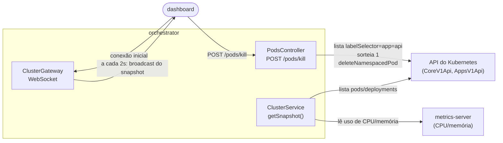

# 4. Serviço `orchestrator`

[← Voltar ao índice](README.md)

Não participa do fluxo de negócio (compra/estoque) de forma alguma. Sua única responsabilidade é observar o cluster Kubernetes de verdade e expor esse estado por WebSocket, além de oferecer o endpoint que mata um pod da `api` sob demanda. Roda na porta padrão `3002`, com 1 a 2 réplicas, sem HPA.



## 4.1 Conexão com a API do Kubernetes (`cluster.module.ts`)

A função `buildKubeConfig()` decide, em tempo de execução, como se autenticar contra o cluster:
- **Dentro do cluster** (quando o `orchestrator` roda como um pod de verdade, detectado pela variável de ambiente `KUBERNETES_SERVICE_HOST`, que o próprio Kubernetes injeta automaticamente em todo pod): usa `kubeConfig.loadFromCluster()`, que lê o token do `ServiceAccount` montado automaticamente no pod (o mesmo `ServiceAccount` definido em `k8s/rbac.yaml`, ver [documento 7](07-kubernetes.md#78-rbac-rbacyaml)).
- **Fora do cluster** (desenvolvimento local, apontando para um Minikube/Kind já rodando na máquina do desenvolvedor): usa `kubeConfig.loadFromDefault()`, que lê o `~/.kube/config` padrão do usuário.

A partir desse `KubeConfig`, o módulo instancia três clientes injetáveis via tokens simbólicos (`CORE_V1_API`, `APPS_V1_API`, `METRICS_CLIENT`): `CoreV1Api` (pods), `AppsV1Api` (deployments) e `Metrics` (cliente para o `metrics-server`, que expõe uso de CPU/memória por pod).

## 4.2 `ClusterService` — leitura do estado do cluster

O método público central é `getSnapshot()`, que roda `readDeployments` e `readPods` **em paralelo** (`Promise.all`) e devolve um `ClusterSnapshot`:

```ts
interface ClusterSnapshot {
  timestamp: string;
  deployments: DeploymentInfo[];  // { name, replicas, readyReplicas }
  pods: PodInfo[];                // { name, app, status, cpuMillis, memoryMebibytes }
}
```

- **`readDeployments`**: para cada nome em `MONITORED_APPS` (constante fixa: `['gateway', 'api', 'orchestrator']`), chama `appsApi.readNamespacedDeployment` e extrai `spec.replicas` (o alvo desejado) e `status.readyReplicas` (quantas réplicas já estão prontas de fato). Se a leitura de um Deployment específico falhar (por exemplo, ele ainda não existe), o erro é logado como aviso e o serviço retorna `{ replicas: 0, readyReplicas: 0 }` para aquele item — em vez de derrubar o snapshot inteiro por causa de um único Deployment indisponível.
- **`readPods`**: lista todos os pods cujo label `app` esteja em `MONITORED_APPS` (`labelSelector: "app in (gateway,api,orchestrator)"`), e cruza cada pod com seu uso de CPU/memória (lido de `readPodUsageByName`, que consulta o `metrics-server`). Se o `metrics-server` estiver indisponível (cenário comum em desenvolvimento local sem ele habilitado), o snapshot ainda é entregue — só sem os números de CPU/memória (`null`), em vez de falhar por completo. O mesmo raciocínio de degradação graciosa vale se a própria listagem de pods falhar (ex.: cluster inacessível): o snapshot chega ao dashboard com uma lista de pods vazia, e a conexão WebSocket não cai por isso.
- **`k8s-quantity.util.ts`**: o `metrics-server` devolve CPU e memória como strings no formato "quantity" do Kubernetes (ex.: `"250m"` para 250 milicores, `"128Mi"` para 128 mebibytes) — não existe conversão pronta para número na biblioteca `@kubernetes/client-node`. Este utilitário implementa os parsers: `parseCpuMillis` entende sufixos `n` (nanocores), `u` (microcores), `m` (milicores) ou nenhum sufixo (cores inteiros); `parseMemoryMebibytes` entende os sufixos binários (`Ki`, `Mi`, `Gi`, `Ti`) e decimais (`K`, `M`, `G`, `T`) do Kubernetes, convertendo tudo para mebibytes para exibição uniforme no dashboard.

## 4.3 Matar um pod aleatório (`killRandomApiPod`)

Exposto via `POST /pods/kill` (`pods.controller.ts`). A implementação:

1. Lista pods filtrando **explicitamente** por `labelSelector: app=api` (a constante `KILLABLE_APP_LABEL`, hoje fixa em `'api'`).
2. Sorteia um pod aleatório dentre os retornados (`Math.random()`).
3. Chama `coreApi.deleteNamespacedPod`.
4. Retorna `{ podName }`.

Esse filtro por label, feito em **código de aplicação**, é a única coisa que impede o botão "matar pod" de sortear e derrubar o Postgres ou o próprio `gateway` — porque a permissão RBAC concedida ao `ServiceAccount` do `orchestrator` (ver [documento 7](07-kubernetes.md#78-rbac-rbacyaml)) é, na prática, mais ampla do que isso: ela permite deletar **qualquer** pod do namespace, já que o RBAC nativo do Kubernetes não sabe filtrar por label. Esse é um risco residual conhecido e documentado — não um bug escondido (ver [documento 12](12-trade-offs-e-como-rodar.md)).

## 4.4 `ClusterGateway` — WebSocket para o dashboard

Um `@WebSocketGateway()` do NestJS, usando o adapter WS puro (não Socket.IO). Duas fontes de envio de dados:

- **`handleConnection`**: assim que um novo cliente WebSocket conecta, recebe imediatamente um snapshot do estado atual — o dashboard nunca fica esperando o próximo ciclo de polling para ver algo na tela.
- **Polling interno a cada 2 segundos** (`POLL_INTERVAL_MS = 2000`, via `setInterval` criado em `afterInit`): a cada tick, chama `getSnapshot()` de novo e faz broadcast do resultado para **todos** os clientes conectados cujo `readyState` seja `OPEN`. Esse polling é interno — do lado do `orchestrator` contra a API do Kubernetes —, mas o resultado chega ao dashboard como um evento único de WebSocket, não como algo que o browser precisa buscar ativamente (o dashboard não faz polling nenhum contra o `orchestrator`; ele só escuta mensagens).
- **`onModuleDestroy`**: limpa o `setInterval` quando o módulo é destruído (parte do graceful shutdown do processo).

## 4.5 Bootstrap (`main.ts`)

Além de `enableCors()` (o botão "matar pod" do dashboard chama `POST /pods/kill` direto do browser) e `enableShutdownHooks()`, a diferença notável em relação aos outros dois serviços é `app.useWebSocketAdapter(new WsAdapter(app))` — troca o adapter padrão do NestJS (que assume Socket.IO) por um adapter de WebSocket puro, permitindo conectar com qualquer cliente WebSocket genérico (inclusive ferramentas de linha de comando como `wscat`), sem exigir um cliente Socket.IO específico do lado do dashboard.

---

[← Anterior: Serviço `gateway`](03-servico-gateway.md) · [Voltar ao índice](README.md) · [Próximo: Dashboard →](05-dashboard.md)
