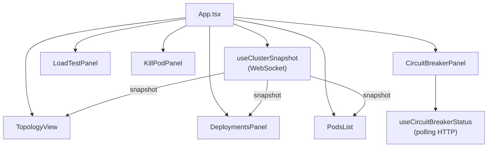
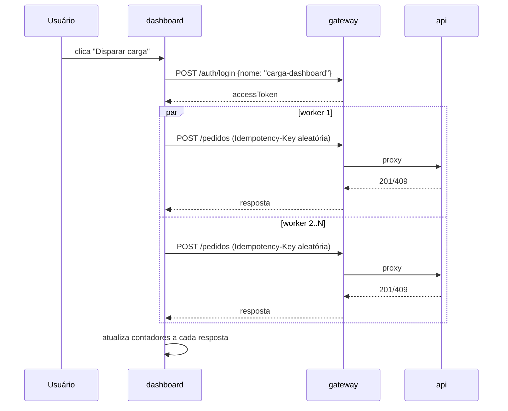

# 5. Dashboard (frontend React)

[← Voltar ao índice](README.md)

Aplicação React (bundlada com Vite) que renderiza, ao vivo, tudo o que o `orchestrator` está observando no cluster — e permite disparar as duas ações que tornam a demonstração interativa: gerar carga de compra e matar um pod.

## 5.1 `App.tsx` — orquestração de alto nível

É o componente raiz. Lê três URLs de variáveis de ambiente do Vite (`VITE_ORCHESTRATOR_WS_URL`, `VITE_ORCHESTRATOR_HTTP_URL`, `VITE_GATEWAY_URL`, cada uma com um fallback para `localhost` nas portas padrão) e o UUID do produto de demonstração (`VITE_PRODUTO_CARGA_ID`, com fallback para o mesmo UUID fixo semeado pela migration do serviço `api`).

Usa o hook `useClusterSnapshot` para manter a conexão WebSocket com o `orchestrator` e renderiza, condicionalmente:
- Um banner de alerta ("Conexão perdida com o orchestrator — tentando reconectar...") enquanto o status da conexão é `fechada`.
- Uma barra de ferramentas com três painéis de ação: `LoadTestPanel`, `KillPodPanel`, `CircuitBreakerPanel`.
- Enquanto nenhum snapshot chegou ainda, uma mensagem de espera; assim que o primeiro snapshot chega, renderiza `TopologyView` (visão gráfica do cluster) e uma grade com `DeploymentsPanel` + `PodsList` (visões tabulares complementares do mesmo dado).

Também controla um estado local `killedPodName`, usado só para acionar uma animação visual temporária (2.6 segundos, `KILL_FLASH_DURATION_MS`) destacando, na topologia, o nó do serviço a que pertencia o pod recém-morto.

## 5.2 Hooks

- **`useClusterSnapshot(url)`** (`hooks/use-cluster-snapshot.ts`): abre uma conexão `WebSocket` nativa do browser contra o `orchestrator`. Expõe `{ snapshot, status }`, onde `status` é `'conectando' | 'aberta' | 'fechada'`. Ao receber cada mensagem, faz `JSON.parse` e substitui o snapshot inteiro no estado do componente. Crucialmente, implementa **reconexão automática**: se a conexão cair (`socket.onclose`), agenda uma nova tentativa de conexão 2 segundos depois (`RECONNECT_DELAY_MS`), em vez de deixar o dashboard congelado no último snapshot recebido para sempre. A função de limpeza do `useEffect` cancela timers pendentes e fecha o socket explicitamente ao desmontar.
- **`useCircuitBreakerStatus(gatewayUrl)`** (`hooks/use-circuit-breaker-status.ts`): não usa WebSocket — faz **polling HTTP** a cada 2 segundos contra `GET {gatewayUrl}/circuit-breaker/status`. Em caso de falha de rede transitória durante o polling, mantém deliberadamente o último estado conhecido em vez de piscar para `'desconhecido'` a cada erro passageiro — evita ruído visual desnecessário na tela durante a demonstração.

## 5.3 Componentes visuais

- **`TopologyView`** (`components/TopologyView.tsx`): o componente mais elaborado do dashboard — desenha um diagrama vivo do cluster, não uma tabela. Mostra o `orchestrator` como um nó de "control plane" separado (com seus próprios pods em miniatura), e depois um fluxo horizontal `Clientes → gateway → api → Estoque`, com cada serviço de workload desenhado como um nó contendo uma barra de capacidade (`CapacityBar`, um slot visual por réplica, preenchido ou vazio conforme `readyReplicas` vs `replicas`) e chips individuais por pod (`PodChips`, coloridos por status: `Running`/`Pending`/`Terminating`). Quando `loadActive` é verdadeiro (durante um disparo de carga), as linhas conectoras entre os nós animam mais rápido e em maior quantidade, dando a sensação visual de tráfego aumentando. Quando um pod é morto (`killedPodName`), o nó do serviço correspondente pisca (`nodeFlash`) e um toast temporário aparece informando qual pod foi encerrado.
- **`DeploymentsPanel`** (`components/DeploymentsPanel.tsx`): tabela simples por Deployment monitorado, mostrando `readyReplicas/replicas` e um rótulo textual "estável" (quando `readyReplicas >= replicas`) ou "escalando" (caso contrário) — é a visão mais direta de "o HPA está agindo agora".
- **`PodsList`** (`components/PodsList.tsx`): tabela crua com um pod por linha — nome, app, status, CPU em millicores, memória em mebibytes (ou `—` quando o `metrics-server` não retornou dados para aquele pod).
- **`KillPodPanel`** (`components/KillPodPanel.tsx`): um botão que chama `POST {orchestratorHttpUrl}/pods/kill`. Mostra estado de carregamento (`matando`), e depois um resultado de sucesso (nome do pod morto) ou erro, comunicando o resultado de volta ao `App` via callback `onPodKilled`, que aciona a animação na topologia.
- **`LoadTestPanel`** (`components/LoadTestPanel.tsx`): botão "Disparar carga" que chama a função `dispatchLoad` (ver seção 5.4) com parâmetros configuráveis por prop (`totalRequisicoes` padrão 200, `concorrencia` padrão 20) e renderiza, em tempo real, quatro contadores conforme o progresso chega via callback: enviados/total, confirmados, rejeitados, erros — cada categoria com sua própria cor semântica (bom/aviso/crítico).
- **`CircuitBreakerPanel`** (`components/CircuitBreakerPanel.tsx`): um badge simples com o estado atual do circuit breaker (lido via `useCircuitBreakerStatus`), traduzido para rótulos em português (`Fechado`/`Aberto`/`Meio-aberto`/`Verificando…`) e uma cor por estado.

## 5.4 `load-dispatcher.ts` — disparo de carga direto do browser

O botão "Disparar carga" do dashboard **não** invoca o script k6 (que roda fora do browser, via linha de comando) — ele é uma alternativa equivalente e mais conveniente para a demonstração ao vivo, disparando requisições HTTP reais diretamente do JavaScript do browser:

1. Faz login (`POST {gatewayUrl}/auth/login` com um nome fixo `'carga-dashboard'`) para obter um token de acesso válido, uma única vez.
2. Sobe `N` "workers" concorrentes (`Math.min(concorrencia, totalRequisicoes)`, cada um sendo uma função assíncrona que consome de um contador compartilhado `proximoIndice`), rodando todos em paralelo via `Promise.all`. Isso é deliberado: disparar todas as `totalRequisicoes` de uma vez com um único `Promise.all` esbarraria no limite de conexões HTTP simultâneas por origem que os browsers impõem, e as requisições chegariam praticamente juntas em vez de sustentar uma carga constante pelo tempo necessário para o HPA reagir e escalar.
3. Cada requisição individual (`dispararPedido`) gera uma nova `Idempotency-Key` aleatória (`crypto.randomUUID()`) — porque aqui o objetivo é simular muitos **clientes diferentes** comprando, não testar o mecanismo de idempotência em si — e classifica o resultado em `'confirmado'` (`201`), `'rejeitado'` (`409`) ou `'erro'` (qualquer outro status, ou exceção de rede).
4. Reporta o progresso incrementalmente via callback `onProgress`, permitindo que o `LoadTestPanel` atualize os contadores na tela em tempo real, requisição por requisição, e não só no final.

## 5.5 `purchase/` — proteção contra duplo clique

Dois artefatos pequenos, mas conceitualmente centrais para a garantia de "zero duplicação" também valer do lado do cliente, não só do banco:

- **`PurchaseAttemptSession`** (`purchase/purchase-attempt-session.ts`): uma classe minúscula cujo construtor gera **uma única vez** um `idempotencyKey` (`crypto.randomUUID()`), guardado como propriedade de instância. A ideia central é que essa chave representa **uma tentativa de compra inteira** — criada quando a tela de compra carrega — e não uma chave nova a cada requisição HTTP individual. Qualquer retry automático dentro da mesma tentativa reaproveita a mesma instância, e portanto a mesma chave.
- **`BuyButtonGuard`** (`purchase/buy-button-guard.ts`): desabilita a possibilidade de executar `tentativaDeCompra` mais de uma vez por instância — a primeira chamada a `executar()` marca `disabled = true` antes mesmo de esperar a Promise resolver, e qualquer chamada seguinte retorna `'ignorado'` sem re-executar nada.

**Por que os dois juntos, e por que nenhum sozinho basta:** a chave de idempotência, sozinha, só protege contra retries automáticos de rede que reenviam a *mesma* requisição já montada com a mesma chave. Ela não protege contra o usuário clicando duas vezes rapidamente no botão de compra — isso geraria, do ponto de vista do backend, duas requisições legítimas e completamente distintas (cada clique poderia, em teoria, gerar sua própria sessão de compra com sua própria chave, se não houvesse nada bloqueando o segundo clique no frontend). O `BuyButtonGuard`, então, é o que impede que um segundo clique sequer dispare uma segunda tentativa, garantindo que a mesma `PurchaseAttemptSession` (e portanto a mesma chave) seja realmente a única usada para aquela tentativa de compra do início ao fim.

---

[← Anterior: Serviço `orchestrator`](04-servico-orchestrator.md) · [Voltar ao índice](README.md) · [Próximo: Banco de dados e PgBouncer →](06-banco-de-dados-e-pgbouncer.md)
