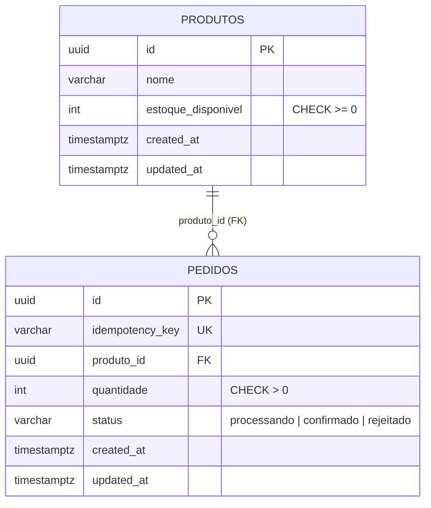
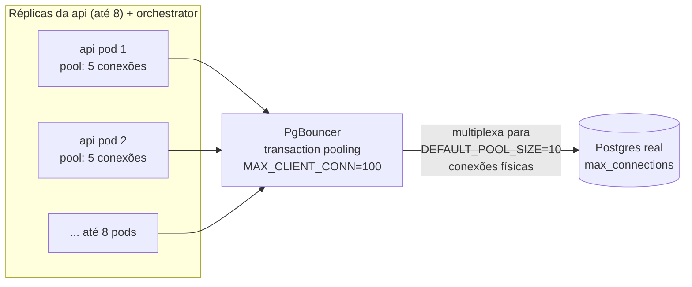

# 6. Banco de dados e PgBouncer

[← Voltar ao índice](README.md)

## 6.1 Schema

**Tabela `produtos`:**
| Coluna | Tipo | Restrições |
|---|---|---|
| `id` | UUID | PK, `DEFAULT gen_random_uuid()` |
| `nome` | VARCHAR(255) | NOT NULL |
| `estoque_disponivel` | INTEGER | NOT NULL, `CHECK (estoque_disponivel >= 0)` |
| `created_at` | TIMESTAMPTZ | NOT NULL, default `now()` |
| `updated_at` | TIMESTAMPTZ | NOT NULL, default `now()` |

**Tabela `pedidos`:**
| Coluna | Tipo | Restrições |
|---|---|---|
| `id` | UUID | PK, `DEFAULT gen_random_uuid()` |
| `idempotency_key` | VARCHAR(255) | NOT NULL, `UNIQUE` |
| `produto_id` | UUID | NOT NULL, FK → `produtos(id)`, indexado |
| `quantidade` | INTEGER | NOT NULL, `CHECK (quantidade > 0)` |
| `status` | VARCHAR(20) | NOT NULL, default `'processando'` |
| `created_at` | TIMESTAMPTZ | NOT NULL, default `now()` |
| `updated_at` | TIMESTAMPTZ | NOT NULL, default `now()` |

A `CHECK (estoque_disponivel >= 0)` e a constraint `UNIQUE (idempotency_key)` são as duas garantias de integridade que existem no próprio banco, independentes de qualquer lógica de aplicação — uma segunda camada de defesa: mesmo que um bug futuro reintroduzisse um `SELECT`+`INSERT` separado ou removesse o `WHERE estoque_disponivel >= :quantidade` do `UPDATE`, essas constraints ainda impediriam o pior desfecho (estoque negativo, ou duas linhas com a mesma chave de idempotência) — embora nesse cenário a aplicação passaria a ver erros de constraint violation em vez de se comportar corretamente, então essas constraints são uma rede de segurança, não um substituto para a lógica atômica correta (detalhada no [documento 2](02-servico-api.md)).

## 6.2 PgBouncer — por que existe e como está configurado

Com o HPA permitindo até 8 réplicas de `api` (mais as réplicas de `orchestrator`), cada uma abrindo seu próprio pool de conexões diretamente contra o Postgres, o número de conexões físicas poderia facilmente se aproximar ou estourar o limite padrão do Postgres (`max_connections`, tipicamente 100) — sobretudo por conta do custo de manter cada conexão Postgres viva (memória, overhead de contexto), não só do número em si.

**PgBouncer** fica entre os serviços e o Postgres real, e multiplexa um número muito maior de conexões "lógicas" dos clientes para um número bem menor de conexões físicas reais no Postgres. Está configurado em modo **`transaction pooling`** (`POOL_MODE: transaction`): uma conexão física do Postgres é emprestada a um cliente **apenas durante a duração de uma transação**, e devolvida ao pool assim que a transação termina (`COMMIT`/`ROLLBACK`) — não fica presa a uma sessão de cliente inteira, como aconteceria em modo `session pooling`.

Isso é o que exige o ajuste `prepare: false` do lado do TypeORM (ver [documento 2, seção 2.7](02-servico-api.md#27-configuração-da-conexão-configdata-sourcets)): como a mesma conexão lógica do cliente pode ser servida por conexões físicas diferentes entre transações, qualquer prepared statement nomeado que dependesse de persistir na mesma conexão física quebraria de forma imprevisível.

Cada migration do TypeORM já roda como uma única transação (`BEGIN...COMMIT` implícito), que é exatamente a unidade que o modo `transaction pooling` sabe segurar numa mesma conexão física do início ao fim — por isso as migrations também passam pelo PgBouncer normalmente, sem precisar de nenhuma rota alternativa direta ao Postgres.

**Configuração de exemplo** (do `docker-compose.yml`, replicada nos manifests do Kubernetes): `AUTH_TYPE: scram-sha-256` (mesmo mecanismo de autenticação do Postgres 16), `MAX_CLIENT_CONN: 100` (teto de conexões de clientes que o PgBouncer aceita) e `DEFAULT_POOL_SIZE: 10` (quantas conexões físicas reais o PgBouncer mantém contra o Postgres por trás dos panos).

---

[← Anterior: Dashboard](05-dashboard.md) · [Voltar ao índice](README.md) · [Próximo: Kubernetes — manifests →](07-kubernetes.md)
