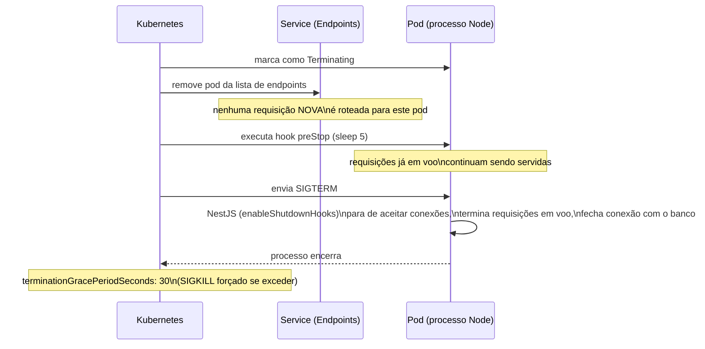
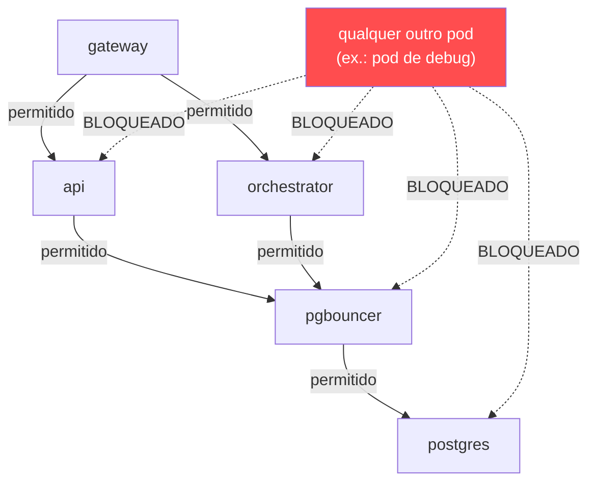

# 7. Kubernetes — manifests

[← Voltar ao índice](README.md)

Todos os recursos vivem no namespace `blackfriday` (`k8s/namespace.yaml`), pensado para rodar em Minikube ou Kind local — nada aqui depende de recursos específicos de uma cloud gerenciada, com a única exceção do `metrics-server`, que precisa ser habilitado separadamente (é um addon padrão do Minikube, ativável com `minikube addons enable metrics-server`).

## 7.1 `ConfigMap` (`configmap.yaml`)

Centraliza configuração não sensível compartilhada pelos serviços: `DB_HOST`/`DB_PORT` apontando para o **PgBouncer** (não o Postgres direto), `DB_DIRECT_HOST`/`DB_DIRECT_PORT` apontando para o Postgres real (usados só pelo próprio Deployment do PgBouncer como seu upstream — `api`/`orchestrator` nunca leem essas duas variáveis), `DB_USER`, `DB_NAME`, as portas de cada serviço, o tempo de expiração do JWT e a URL interna da `api` que o `gateway` usa para fazer proxy (`API_BASE_URL: http://api:3001` — resolvido via DNS interno do Kubernetes, `<nome-do-service>.<namespace>.svc.cluster.local`, abreviado para `api` porque estão no mesmo namespace).

## 7.2 `Secret` (`secrets.example.yaml` / `secrets.yaml`)

Dois segredos: `POSTGRES_PASSWORD` e `JWT_SECRET`. **Nenhum dos dois é hardcoded em nenhum manifest versionado.** `secrets.example.yaml` é o template versionado no repositório, com valores de placeholder óbvios ("troque-por-uma-senha-forte-gerada-localmente"); o arquivo real, `secrets.yaml`, é criado localmente a partir do template (ou via `kubectl create secret` diretamente) e está no `.gitignore` — nunca é commitado. Os Deployments referenciam esses valores via `secretKeyRef`, nunca em texto puro.

## 7.3 Deployments

- **`deployment-api.yaml`**: 2 réplicas iniciais (o HPA depois ajusta entre 2 e 8). Tem um **initContainer** chamado `migrate` que roda `npm run migration:run` **antes** do container principal da `api` subir — garantindo que o schema do banco já esteja atualizado antes de qualquer réplica começar a aceitar tráfego. `terminationGracePeriodSeconds: 30` e um hook `preStop` com `sleep 5` (ver seção 7.6 sobre graceful shutdown). Probes de `readiness`/`liveness` via TCP na porta 3001. Limites de recursos: `requests` de 100m CPU / 128Mi memória, `limits` de 500m CPU / 512Mi memória.
- **`deployment-gateway.yaml`**: estrutura quase idêntica à da `api` (mesmos `terminationGracePeriodSeconds`, `preStop`, probes, limites de recursos), mas sem initContainer de migration (o `gateway` não toca no banco) e injetando `JWT_SECRET` via `secretKeyRef` (a `api` não precisa desse segredo — só o `gateway` assina e valida tokens).
- **`deployment-postgres.yaml`**: réplica única, com `strategy: Recreate` (em vez do padrão `RollingUpdate`) — deliberado, porque um `RollingUpdate` tentaria subir um segundo pod de Postgres antes de derrubar o primeiro, e os dois tentariam montar o mesmo `PersistentVolumeClaim` `ReadWriteOnce` ao mesmo tempo, o que falha. `Recreate` garante que o pod antigo é totalmente terminado antes do novo subir. Usa `postgres-pvc` para persistência de dados entre reinícios do pod.
- **`deployment-pgbouncer.yaml`**: réplica única, lendo `DB_DIRECT_HOST`/`DB_DIRECT_PORT` do `ConfigMap` como seu upstream real e a senha do `Secret`, com `POOL_MODE: transaction` fixado diretamente no manifest.

## 7.4 `Service`s

Um `Service` do tipo `ClusterIP` (implícito, o padrão) para cada Deployment de workload (`api`, `gateway`, `postgres`, `pgbouncer`), cada um simplesmente selecionando pods pelo label `app` correspondente e expondo a mesma porta que o container escuta. Nenhum desses `Service`s por si só expõe nada para fora do cluster — `ClusterIP` só é alcançável de dentro do cluster.

## 7.5 HPA (`hpa-api.yaml`)

`HorizontalPodAutoscaler` (`autoscaling/v2`) mirando o Deployment `api`, com `minReplicas: 2`, `maxReplicas: 8`, escalando com base em uma única métrica de recurso: uso médio de CPU alvo de **70%** (`averageUtilization: 70`). Não há (ainda) um manifest de HPA para o `gateway` versionado neste repositório — a arquitetura descrita no [documento 1](01-visao-geral-e-arquitetura.md) prevê o `gateway` também escalando (2–4 réplicas) por CPU, mas com a limitação de métrica já documentada.

## 7.6 Graceful shutdown — como as peças se encaixam

Este comportamento depende de três coisas trabalhando juntas, e vale entender a ordem exata dos eventos quando um pod é terminado (seja por decisão manual, seja pelo HPA reduzindo réplicas):

1. O Kubernetes marca o pod como `Terminating` e, **antes** de mandar `SIGTERM`, executa o hook `preStop` do container — aqui, um simples `sleep 5`. Durante esses 5 segundos, o Kubernetes já removeu o pod da lista de endpoints do `Service` correspondente (então nenhuma requisição *nova* é roteada para ele), mas o processo Node.js dentro do container ainda está totalmente vivo e pode terminar qualquer requisição que já estava em andamento.
2. Depois do `preStop` terminar, o Kubernetes envia `SIGTERM` ao processo. Como cada `main.ts` chama `app.enableShutdownHooks()`, o NestJS escuta esse sinal, para de aceitar novas conexões, espera as requisições em voo terminarem, e fecha a conexão com o banco de dados de forma limpa antes do processo sair.
3. Só depois disso — e do `terminationGracePeriodSeconds: 30` total (tempo máximo que o Kubernetes espera antes de forçar um `SIGKILL`) — o pod é de fato removido.

O resultado prático, testável ao vivo na demonstração: matar um pod da `api` no meio de uma compra em andamento não deve gerar erro nenhum para quem estava comprando — a requisição em voo tem tempo de terminar, e nenhuma requisição nova chega a ser roteada para um pod que já está de saída.

## 7.7 `NetworkPolicy` — isolamento de rede

Por padrão, dentro de um cluster Kubernetes, qualquer pod consegue chamar qualquer outro pod diretamente pelo DNS interno — a ausência de um `Ingress` externo para `api`/`orchestrator` não significa isolamento nenhum contra tráfego que já esteja dentro do cluster. As três `NetworkPolicy`s deste projeto fecham essa brecha:

- **`networkpolicy-api.yaml`** (`api-allow-only-gateway`): só aceita tráfego de entrada (`Ingress`) vindo de pods com o label `app: gateway`. Qualquer outro pod do namespace — inclusive um pod comprometido ou um pod de debug — não consegue mais falar direto com a `api`, contornando a autenticação do `gateway`.
- **`networkpolicy-orchestrator.yaml`** (`orchestrator-allow-only-gateway`): a mesma regra, aplicada ao `orchestrator`. (Na prática, hoje o dashboard fala com o `orchestrator` direto do browser via CORS liberado, não através do `gateway` — essa política protege o tráfego *interno* pod-a-pod dentro do cluster, que é uma superfície de ataque diferente da exposta externamente.)
- **`networkpolicy-postgres.yaml`**: define **duas** políticas no mesmo arquivo. A primeira (`postgres-allow-only-backend`) restringe o Postgres a só aceitar conexões de pods com label `app: pgbouncer` — nem `api` nem `orchestrator` conseguem falar direto com o Postgres, precisam necessariamente passar pelo PgBouncer. A segunda (`pgbouncer-allow-only-backend`) restringe o próprio PgBouncer a só aceitar conexões de `app: api` ou `app: orchestrator`.

O efeito combinado: um pod qualquer dentro do namespace, mesmo que comprometido, não consegue falar diretamente nem com `api`/`orchestrator` (contornando a autenticação do `gateway`) nem com o banco de dados (contornando toda a camada de aplicação) — a única defesa nesses dois pontos deixa de ser "a senha do Postgres" ou "nada" e passa a ser isolamento de rede real, reforçado no nível da própria infraestrutura.

## 7.8 RBAC (`rbac.yaml`)

Define um `ServiceAccount` (`orchestrator-sa`), um `Role` (`orchestrator-role`) e um `RoleBinding` que liga os dois, tudo escopado ao namespace `blackfriday`. O `Role` concede, sobre o recurso `pods`, os verbos `get`, `list`, `watch` (necessários para o `orchestrator` ler o estado do cluster) e **`delete`** (necessário para o botão "matar pod aleatório" funcionar de verdade — uma versão anterior deste projeto só tinha `get/list/watch`, o que faria o endpoint de matar pod falhar com `403 Forbidden` ao vivo).

**Risco residual declarado, não escondido:** o `Role` acima concede `delete` sobre **qualquer** pod do namespace `blackfriday` — não existe, no RBAC nativo do Kubernetes, uma forma de restringir um verbo a um `labelSelector` específico (RBAC filtra por tipo de recurso e verbo, não por conteúdo/label do objeto). A restrição real a "só pods com label `app=api`" existe **apenas** no código do `orchestrator` (`ClusterService.killRandomApiPod`, ver [documento 4](04-servico-orchestrator.md#43-matar-um-pod-aleatório-killrandomapipod)). Isso significa que um bug nesse filtro em código — ou uma futura chamada manual usando essa mesma credencial de `ServiceAccount` — ainda teria, em nível de infraestrutura, permissão para deletar o Postgres ou o `gateway`. Duas mitigações possíveis, nenhuma implementada por padrão neste MVP (documentadas como evolução natural, não como um bug escondido): (a) mover os pods da `api` para um namespace dedicado, com o `Role` do `orchestrator` escopado só a esse namespace — uma restrição real de infraestrutura; ou (b) aceitar o risco como está, documentado, suficiente para um projeto de portfólio desde que declarado. Mais detalhes em [documento 12 — Trade-offs](12-trade-offs-e-como-rodar.md).

## 7.9 `PersistentVolumeClaim` (`postgres-pvc.yaml`)

Um `PVC` de 1Gi, `ReadWriteOnce` (montável por um único nó por vez — suficiente porque só existe uma réplica de Postgres), consumido pelo `deployment-postgres.yaml` para persistir os dados do banco entre reinícios do pod.

---

[← Anterior: Banco de dados](06-banco-de-dados-e-pgbouncer.md) · [Voltar ao índice](README.md) · [Próximo: Segurança →](08-seguranca.md)
