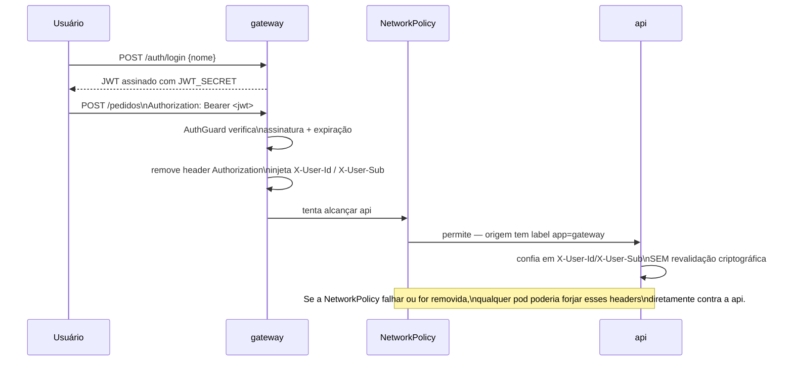

# 8. Segurança — modelo de confiança de ponta a ponta

[← Voltar ao índice](README.md)

Vale entender este modelo como um fluxo único, porque cada peça só é segura por causa da peça seguinte:

1. O usuário faz login no `gateway` e recebe um JWT **real** — assinado com HMAC usando `JWT_SECRET`, um segredo que só o `gateway` conhece (guardado em `Secret` do Kubernetes, nunca em texto puro em nenhum manifest versionado).
2. Toda requisição subsequente do usuário carrega esse JWT no header `Authorization`. O `AuthGuard` do `gateway` verifica assinatura e expiração de verdade — não é uma simulação de autenticação, é autenticação real.
3. Ao encaminhar a requisição para a `api`, o `gateway` **remove** o header `Authorization` original e o substitui por dois headers internos, próprios: `X-User-Id` e `X-User-Sub`, derivados do payload já validado do JWT.
4. A `api` (e o `orchestrator`) **não re-verificam nada criptograficamente** — eles simplesmente confiam que `X-User-Id`/`X-User-Sub` são genuínos, sem validar assinatura nenhuma nesses headers.

**Isso só é seguro porque, e apenas porque, a `NetworkPolicy` (ver [documento 7, seção 7.7](07-kubernetes.md#77-networkpolicy--isolamento-de-rede)) garante que a `api` e o `orchestrator` só aceitam conexões de entrada vindas de pods com o label `app: gateway`.** Se essa `NetworkPolicy` fosse removida, ou se ela tivesse um bug, qualquer outro pod no namespace poderia forjar esses dois headers diretamente contra a `api`, se passando por qualquer usuário, sem precisar de token nenhum — porque a `api` não tem uma segunda camada de verificação própria nessa borda.

Esse padrão — às vezes chamado de "edge-terminated auth" ou "trust boundary na borda" — é comum em arquiteturas reais (é essencialmente o mesmo modelo de confiança que existe atrás de muitos API Gateways de mercado) e é uma decisão aceitável para este projeto, mas é **uma decisão consciente, com uma dependência única e declarada** (a `NetworkPolicy` não ser violada), não uma garantia com múltiplas camadas independentes de defesa. A evolução natural, fora do escopo deste MVP, seria mTLS entre serviços, ou uma segunda assinatura interna (um segredo compartilhado só entre `gateway` e os serviços internos) para re-assinar esses headers antes de repassá-los, de forma que mesmo sem a `NetworkPolicy` um header forjado seria detectável.

Mais trade-offs de segurança conscientemente aceitos (RBAC, HPA por CPU) estão detalhados no [documento 12](12-trade-offs-e-como-rodar.md).

## Rate limiting

Rate limiting é aplicado por usuário autenticado (usando a identidade real do JWT, que agora faz sentido confiar justamente porque é um JWT de verdade) **e**, como camada adicional de defesa em profundidade, também por IP — cobrindo o caso de requisições anônimas ou pré-login, que não têm ainda uma identidade de usuário à qual amarrar o limite.

---

[← Anterior: Kubernetes](07-kubernetes.md) · [Voltar ao índice](README.md) · [Próximo: Testes →](09-testes.md)
