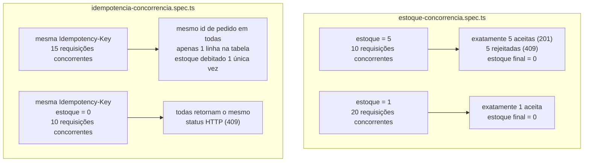

# 9. Testes

[← Voltar ao índice](README.md)

A filosofia de testes deste projeto segue TDD (RED → GREEN → REFACTOR) e trata os testes de concorrência como o artefato mais valioso do repositório — mais importante, em termos de garantia real, do que qualquer demonstração ao vivo.

## 9.1 Testes de integração de concorrência (`tests/integration/`)

Rodam contra um Postgres real (via `docker-compose`, ou o serviço Postgres provisionado no CI) — nunca contra um banco mockado, porque o próprio objetivo do teste é validar comportamento real de concorrência no nível do banco de dados, algo que um mock jamais reproduziria fielmente.

- **`estoque-concorrencia.spec.ts`**: dois cenários. No primeiro, cria um produto com `estoque_disponivel = 5` e dispara **10 requisições concorrentes** de 1 unidade cada (via `Promise.all`, cada uma com sua própria `Idempotency-Key` distinta), esperando exatamente 5 aceitas (`201`) e 5 rejeitadas (`409`), com o estoque final em exatamente `0`. No segundo, um cenário ainda mais apertado — estoque de apenas `1` unidade contra **20 requisições concorrentes** — esperando exatamente 1 pedido aceito e estoque final `0`, provando que o `UPDATE` atômico (ver [documento 2](02-servico-api.md)) segura a linha mesmo sob concorrência bem mais alta que o estoque disponível.
- **`idempotencia-concorrencia.spec.ts`**: dois cenários que testam especificamente o `ON CONFLICT DO NOTHING`. No primeiro, **15 requisições concorrentes** usam a **mesma** `Idempotency-Key` contra um produto com estoque 5 — o teste verifica que todas as respostas retornam o **mesmo** `id` de pedido, que existe exatamente **uma** linha na tabela `pedidos` com aquela chave, e que o estoque foi debitado uma única vez (`5 - 1 = 4`, nunca menos). No segundo, o mesmo padrão contra um produto **sem estoque** (`estoque_disponivel = 0`), verificando que todas as 10 requisições concorrentes retornam o mesmo status HTTP (`409`), provando que não existe uma janela em que requisições concorrentes com a mesma chave veem desfechos diferentes entre si.
- **`helpers/test-app.ts`**: utilitário compartilhado que sobe uma instância real do `AppModule` da `api` via `Test.createTestingModule` do NestJS, chamando `app.listen(0)` (porta efêmera do sistema operacional) — um detalhe não óbvio necessário para o `supertest` funcionar corretamente sob alta concorrência: sem uma porta real vinculada, o `supertest`, em cada chamada concorrente, tenta gerenciar o ciclo de vida do `http.Server` sozinho e pode fechá-lo prematuramente, derrubando outras requisições em voo com `ECONNRESET`. Também expõe `limparTabelas` (um `TRUNCATE ... RESTART IDENTITY CASCADE` entre testes) e `criarProduto` (helper de setup).
- **`gateway/gateway-auth-proxy.spec.ts`**: sobe o `gateway` real (com uma `api` **falsa**, um `http.Server` cru que só captura o que recebeu, no lugar da `api` de verdade) e valida: login retorna um JWT com três segmentos separados por ponto (formato JWT válido); login sem nome é rejeitado com `400`; uma requisição proxied sem token é rejeitada com `401`; um token assinado com uma chave **diferente** da configurada no `gateway` é rejeitado com `401` (prova de que a verificação de assinatura é real, não decorativa); e que uma requisição com token válido chega até a `api` falsa com os headers internos corretos (`x-user-sub`, `x-user-id`) e sem o header `Authorization` original.
- **`gateway/circuit-breaker.spec.ts`**: também usa uma `api` falsa cujo status de resposta é controlado pelo teste. Valida a máquina de estados inteira (ver [documento 3](03-servico-gateway.md#33-circuit-breaker-circuit-breaker)): o circuito começa `fechado`; após exatamente 5 respostas `500` consecutivas da `api` falsa, o circuito abre e passa a responder `503` **sem sequer chamar** a `api` falsa (contando as chamadas recebidas antes e depois, e confirmando que o número não muda); depois de esperar 5.1 segundos (passando do limiar de 5s), o circuito vira `meio-aberto`; se a única requisição de teste permitida nesse estado tiver sucesso (a `api` falsa devolvendo `200`), o circuito fecha de novo e volta a aceitar tráfego normalmente.

## 9.2 Testes unitários (`tests/unit/`)

Cobrem lógica isolada, sem depender de rede ou banco real: o `AuthGuard` e o `AuthService` do `gateway` (geração/validação de JWT), o `CircuitBreakerService` e o `CircuitBreakerController` (transições de estado puras), o `ProxyService` (montagem de headers, comportamento sob diferentes respostas), o `ClusterService`, `ClusterGateway`, `PodsController` e `k8s-quantity.util` do `orchestrator` (com o cliente `@kubernetes/client-node` mockado), e, do lado do dashboard, o `BuyButtonGuard` e a `PurchaseAttemptSession`.

## 9.3 Teste de carga (`tests/load/pedidos-load.js`, k6)

Complementa os testes de integração (que rodam sem rede real, sobre uma única instância de processo) simulando um cenário de rede de verdade, com múltiplos "usuários virtuais" (VUs) concorrentes contra o `gateway` já em pé (local ou no cluster).

- **Cenário** (`ramping-vus`): sobe gradualmente de 0 até `VUS` usuários virtuais em 10 segundos, sustenta esse nível por `DURATION` (padrão 60s), depois desce de volta a 0 em mais 10 segundos — um perfil de rampa que dá tempo do HPA reagir de verdade, em vez de um pico instantâneo que já teria passado antes do HPA sequer calcular a média de CPU.
- Cada iteração de VU: faz login uma vez (função `setup()`, compartilhando o token entre todas as iterações) e depois, repetidamente, tenta comprar 1 unidade do produto de demonstração com uma `Idempotency-Key` nova a cada tentativa (`k6-${__VU}-${__ITER}-${Date.now()}-${Math.random()}` — única por VU e iteração).
- **Thresholds que falham a execução do script** (não é um teste manual "achando que passou"): `http_req_failed` precisa ficar abaixo de 1% (nenhuma falha de infraestrutura relevante — timeouts, conexão recusada, `5xx` — sob a carga); e a métrica customizada `pedidos_confirmados` precisa ficar **menor ou igual a 500**, o exato estoque inicial semeado pela migration de seed — uma prova automatizada, sob carga de rede real e múltiplos processos concorrentes, de que não há overselling, complementar (não substituta) aos testes de integração de processo único.
- Um detalhe técnico do próprio script: `http.setResponseCallback(http.expectedStatuses(200, 201, 409))` ensina o k6 a não contar `201` (confirmado) nem `409` (rejeitado por falta de estoque ou idempotência) como falhas de requisição — são desfechos de negócio esperados e corretos sob essa carga, distintos de uma falha real de infraestrutura.

---

[← Anterior: Segurança](08-seguranca.md) · [Voltar ao índice](README.md) · [Próximo: CI/CD e Docker →](10-cicd-e-docker.md)
