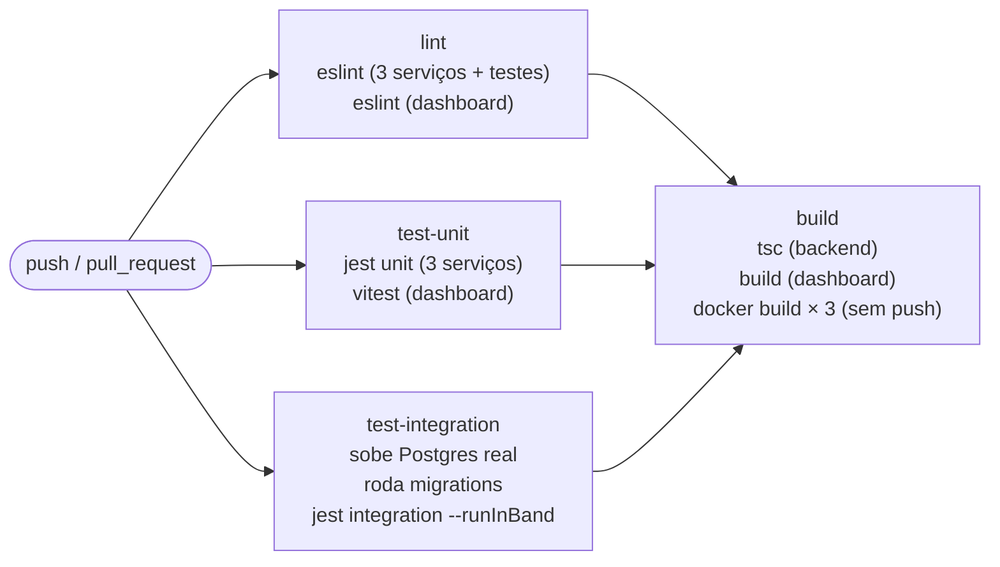
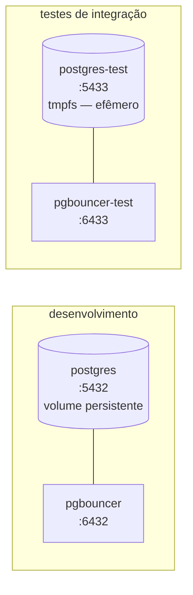

# 10. CI/CD (GitHub Actions) e Docker

[← Voltar ao índice](README.md)

## 10.1 Pipeline de CI

Definido em `.github/workflows/ci.yaml`, disparado em todo `push` e `pull_request`. Composto por quatro jobs, os três primeiros em paralelo e o último dependente deles:

1. **`lint`**: roda ESLint nos três serviços de backend + testes (`npm run lint`, usando a configuração compartilhada em `config/eslint.config.mjs`) e, separadamente, no `dashboard` (que tem seu próprio `package.json`/lint).
2. **`test-unit`**: roda os testes unitários de backend (`npm run test:unit`, usando `config/jest.unit.config.js`) e, separadamente, os testes do `dashboard`.
3. **`test-integration`**: sobe um **serviço Postgres real** como parte do próprio job do GitHub Actions (`services: postgres: image: postgres:16-alpine`, com healthcheck via `pg_isready`), roda as migrations contra ele (`npm run migration:run`) e então executa os testes de integração (`npx jest --config config/jest.integration.config.js --runInBand` — `--runInBand` roda os testes de um mesmo arquivo em sequência dentro do processo Jest, o que é irrelevante para a concorrência *dentro* de cada teste, já que essa concorrência é gerada explicitamente via `Promise.all` dentro do próprio teste, não pelo paralelismo do Jest). Este é, deliberadamente, o job mais importante do pipeline: se alguém remover o `WHERE estoque_disponivel >= :quantidade` do `UPDATE` atômico, ou trocar o `ON CONFLICT DO NOTHING` por um `SELECT` seguido de `INSERT` numa refatoração futura, é este job que quebra imediatamente, em vez de o problema ser descoberto ao vivo numa demonstração (detalhes desses testes: [documento 9](09-testes.md)).
4. **`build`** (depende dos três anteriores via `needs: [lint, test-unit, test-integration]`): compila o TypeScript de backend (`npm run build`, usando `tsconfig.build.json`) e o build de produção do dashboard (`npm run build` dentro de `dashboard/`), e então builda as três imagens Docker (`gateway`, `api`, `orchestrator`) só para validar que cada `Dockerfile` builda com sucesso — **sem** fazer push para nenhum registry.

**Deliberadamente fora do escopo deste CI:** deploy automatizado contra um cluster Kubernetes. Isso é uma decisão consciente, não uma lacuna — o cluster alvo deste projeto é local e efêmero (Minikube/Kind), então não existe um cluster remoto persistente contra o qual fizesse sentido automatizar deploy contínuo. O pipeline de build+test já é o sinal de maturidade de engenharia relevante para este escopo.

## 10.2 `Dockerfile`s

Os três (`services/api/Dockerfile`, `services/gateway/Dockerfile`, `services/orchestrator/Dockerfile`) seguem exatamente o mesmo padrão simples (imagem única, sem multi-stage build): partem de `node:20-alpine`, copiam os arquivos de manifesto (`package.json`, `package-lock.json`, os dois `tsconfig`) primeiro e rodam `npm ci` (aproveitando cache de camada Docker quando só o código muda, não as dependências), depois copiam `services/` e `dashboard/` inteiros, rodam `npm run build` (compila TypeScript de todos os serviços de uma vez, já que compartilham um único `tsconfig.build.json`), e finalmente definem o `CMD` apontando para o arquivo compilado específico daquele serviço (ex.: `node dist/services/api/src/main.js`). Cada imagem expõe a porta padrão do seu serviço (3001/3000/3002) e define `NODE_ENV=production`.

## 10.3 `docker-compose.yml` — ambiente de desenvolvimento local

Não sobe os serviços de aplicação (`api`/`gateway`/`orchestrator` rodam localmente via `npm run start:dev` e afins, fora de container, para permitir hot-reload) — sobe só a infraestrutura de dados, e em **dobro**: um par para desenvolvimento e um par independente para testes.

- **`postgres`**: Postgres 16, com um volume nomeado persistente (`flashscale-postgres-data`) e healthcheck via `pg_isready`.
- **`postgres-test`**: uma segunda instância de Postgres, com um banco de nome diferente (`flashscale_test`) e usando `tmpfs` em vez de um volume persistente — os dados de teste vivem só em memória e desaparecem ao recriar o container, o que é desejável para testes (sempre começam de um estado limpo, sem lixo acumulado de execuções anteriores).
- **`pgbouncer`** / **`pgbouncer-test`**: um PgBouncer para cada Postgres, ambos em modo `transaction pooling`, espelhando exatamente a topologia de produção descrita no [documento 6](06-banco-de-dados-e-pgbouncer.md) — para que rodar os testes de integração localmente exercite o mesmo caminho de conexão (através de um pooler, com prepared statements desligados) que existiria no cluster real, em vez de testar contra um caminho de conexão diferente do de produção.

---

[← Anterior: Testes](09-testes.md) · [Voltar ao índice](README.md) · [Próximo: Fluxos completos →](11-fluxos-completos.md)
