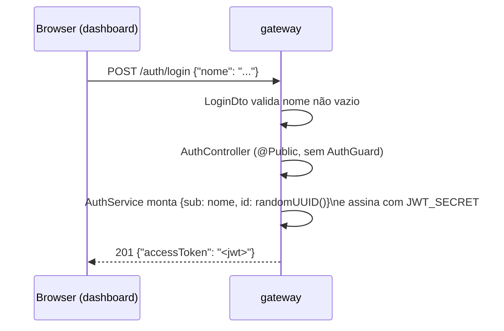
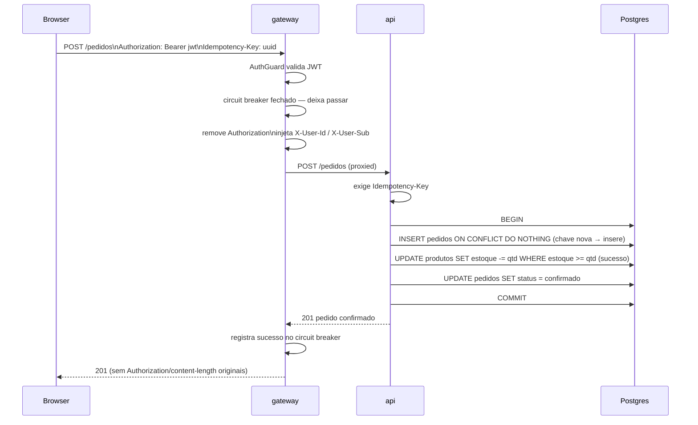
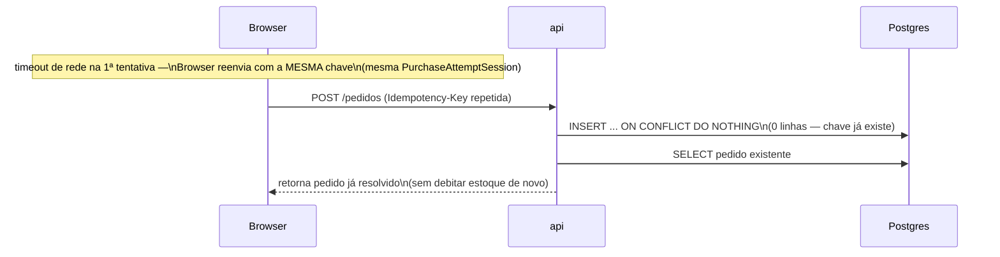
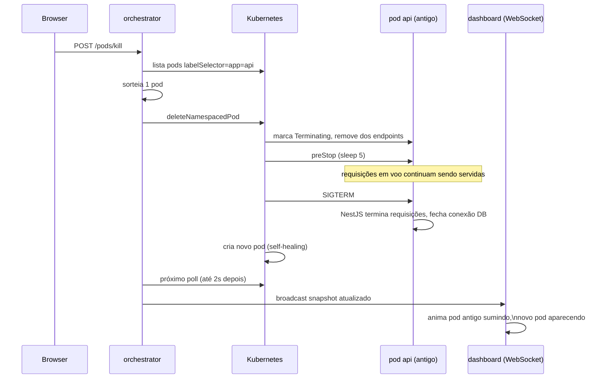
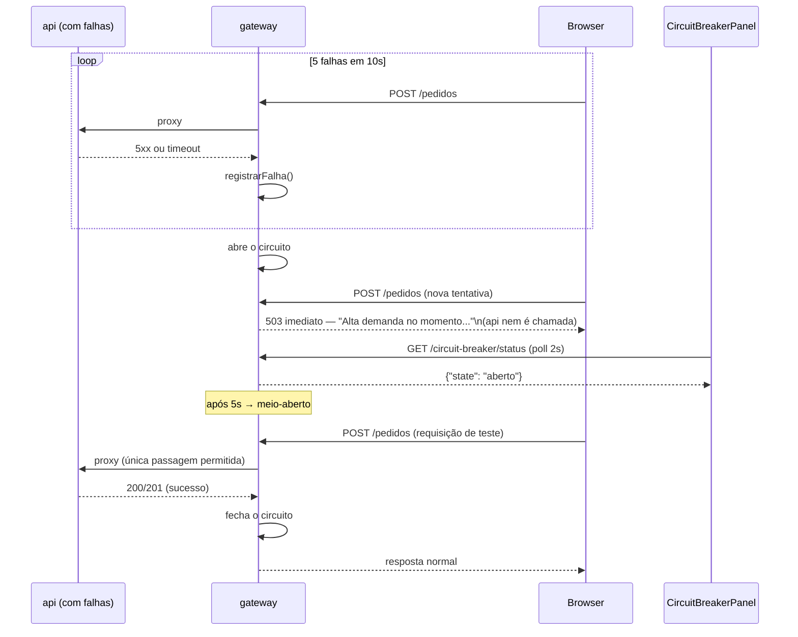

# 11. Fluxos completos, passo a passo

[← Voltar ao índice](README.md)

## 11.1 Login

## 11.2 Compra (caminho feliz, estoque disponível)

## 11.3 Compra (estoque insuficiente)

Idêntico ao fluxo acima até o `UPDATE` de estoque, mas ele afeta zero linhas (`estoque_disponivel < quantidade` no momento exato) — o pedido é marcado `rejeitado`, a transação ainda faz commit normalmente (rejeitar um pedido não é um erro, é um desfecho de negócio válido), e a `api` responde `409`.

## 11.4 Retry de rede com a mesma `Idempotency-Key`

## 11.5 Duplo clique do usuário no botão de compra

O `BuyButtonGuard` (ver [documento 5](05-dashboard.md#55-purchase--proteção-contra-duplo-clique)) marca `disabled = true` no primeiro clique, antes mesmo da primeira requisição terminar — o segundo clique é ignorado no próprio frontend e nunca chega a gerar uma segunda chamada de rede.

## 11.6 Matar um pod da `api` durante uma compra em andamento

Como o Deployment `api` pede 2+ réplicas (e o HPA pode ter mais), o `Service` `api` continua tendo pelo menos uma réplica saudável recebendo tráfego durante todo o processo — o usuário, na prática, não vê erro nenhum. Detalhes de graceful shutdown: [documento 7, seção 7.6](07-kubernetes.md#76-graceful-shutdown--como-as-peças-se-encaixam).

## 11.7 Circuit breaker abrindo sob falhas da `api`

---

[← Anterior: CI/CD e Docker](10-cicd-e-docker.md) · [Voltar ao índice](README.md) · [Próximo: Trade-offs e como rodar →](12-trade-offs-e-como-rodar.md)
