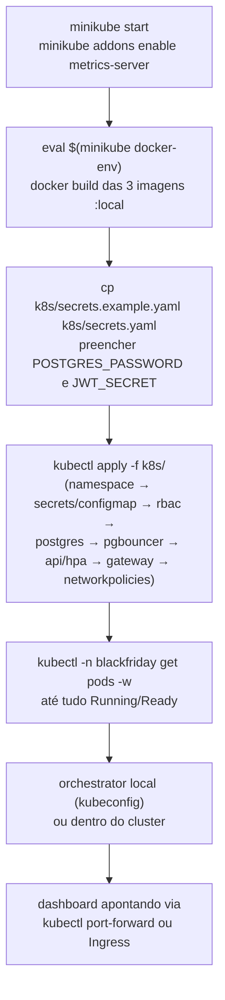

# 12. Trade-offs conscientemente aceitos, limitações conhecidas e como rodar o projeto

[← Voltar ao índice](README.md)

## 12.1 Trade-offs conscientemente aceitos e limitações conhecidas

Estes itens são decisões implementadas, não lacunas escondidas — cada um tem uma mitigação parcial já em vigor e uma evolução natural declarada, deliberadamente fora do escopo deste MVP:

1. **RBAC do `orchestrator` permite `delete` em qualquer pod do namespace** ([documento 7, seção 7.8](07-kubernetes.md#78-rbac-rbacyaml)); a restrição real a "só pods `app=api`" existe apenas em código ([documento 4, seção 4.3](04-servico-orchestrator.md#43-matar-um-pod-aleatório-killrandomapipod)). Mitigação de infraestrutura (namespace dedicado) é evolução futura.
2. **`api`/`orchestrator` confiam nos headers `X-User-Id`/`X-User-Sub` sem re-verificação criptográfica própria** ([documento 8](08-seguranca.md)); a única barreira real é a `NetworkPolicy`. mTLS entre serviços, ou uma re-assinatura interna desses headers, seriam o próximo passo natural.
3. **HPA do `gateway` escala por percentual de CPU**, uma métrica imprecisa para uma carga majoritariamente I/O-bound ([documento 1](01-visao-geral-e-arquitetura.md#por-que-o-gateway-também-tem-hpa)). Aceito porque HPA impreciso ainda é estritamente melhor que nenhum HPA; uma métrica customizada de "requisições em voo" via Prometheus Adapter seria o refinamento natural.
4. **Login sem senha, CORS liberado em `gateway` e `orchestrator`**: simplificações deliberadas de MVP — não existe conceito de conta de usuário real neste sistema, e o dashboard precisa poder chamar esses serviços diretamente do browser para as ações interativas (disparar carga, matar pod) funcionarem sem um backend intermediário próprio do dashboard.
5. **Fora do escopo do MVP, por decisão explícita, não por esquecimento:** OpenTelemetry / tracing distribuído completo; deploy em cloud gerenciada (o projeto é desenhado para portar facilmente, mas roda só local); Helm/Kustomize (YAML puro é considerado aceitável para o número atual de manifests); cancelamento de pedido ou reposição manual de estoque fora de um endpoint administrativo de reset.

## 12.2 Como rodar o projeto localmente

### Rodando os serviços diretamente com Node (sem Kubernetes, para desenvolvimento rápido)

1. Subir a infraestrutura de dados: `npm run docker:up` (sobe `postgres`, `postgres-test`, `pgbouncer` e `pgbouncer-test` via `docker-compose.yml`).
2. Instalar dependências de backend na raiz: `npm install`.
3. Rodar as migrations contra o banco de desenvolvimento: `npm run migration:run`.
4. Subir cada serviço em modo desenvolvimento (com hot-reload via `ts-node-dev`), cada um em seu próprio terminal:
   - `npm run start:dev` (sobe a `api`, porta 3001).
   - `npm run start:gateway:dev` (sobe o `gateway`, porta 3000) — exige `JWT_SECRET` definido no ambiente.
   - `npm run start:orchestrator:dev` (sobe o `orchestrator`, porta 3002) — exige um kubeconfig válido apontando para um cluster (Minikube/Kind) já rodando, para as chamadas à API do Kubernetes funcionarem; sem isso, o `ClusterService` ainda funciona, mas devolve listas de pods/deployments vazias (degradação graciosa, ver [documento 4](04-servico-orchestrator.md)).
5. Instalar e subir o dashboard: `npm run dashboard:install` seguido de `npm run dashboard:dev` (Vite sobe um servidor de desenvolvimento, tipicamente em `http://localhost:5173`).

### Rodando os testes

- Testes unitários: `npm run test:unit`.
- Testes de integração (exige `postgres-test`/`pgbouncer-test` no ar via `docker-compose`): `npm run test:integration` (roda as migrations contra o banco de teste e depois os testes, usando o arquivo `.env.test` para apontar para a porta correta do PgBouncer de teste).
- Testes do dashboard: `npm run dashboard:test`.
- Teste de carga k6 (exige `gateway`/`api` já rodando e acessíveis): `npm run test:load`, ou diretamente `k6 run tests/load/pedidos-load.js`, com variáveis opcionais `-e VUS=50 -e DURATION=60s` para ajustar a intensidade.

### Rodando em Kubernetes (Minikube/Kind)

1. Subir um cluster local (Minikube ou Kind) e habilitar o `metrics-server` (no Minikube: `minikube addons enable metrics-server`) — sem isso, o dashboard mostra CPU/memória como `—` para todos os pods, mas o resto do sistema funciona normalmente.
2. Construir as três imagens Docker localmente com as tags esperadas pelos manifests (`flashscale-api:local`, `flashscale-gateway:local`, e a equivalente para `orchestrator`), garantindo que o cluster consiga enxergar essas imagens locais (`imagePullPolicy: Never` nos manifests assume isso — em Minikube, isso geralmente significa construir as imagens usando o daemon Docker do próprio Minikube, via `eval $(minikube docker-env)`, antes do `docker build`).
3. Copiar `k8s/secrets.example.yaml` para `k8s/secrets.yaml`, preencher `POSTGRES_PASSWORD` e `JWT_SECRET` com valores reais gerados localmente (nunca versionar esse arquivo).
4. Aplicar os manifests, na ordem que respeita as dependências: `namespace.yaml` → `secrets.yaml` + `configmap.yaml` → `rbac.yaml` → `postgres-pvc.yaml` → `deployment-postgres.yaml` + `service-postgres.yaml` → `deployment-pgbouncer.yaml` + `service-pgbouncer.yaml` → `networkpolicy-postgres.yaml` → `deployment-api.yaml` + `service-api.yaml` → `deployment-gateway.yaml` + `service-gateway.yaml` → `networkpolicy-api.yaml` + `networkpolicy-orchestrator.yaml` → `hpa-api.yaml` (na prática, `kubectl apply -f k8s/` aplica tudo de uma vez e o Kubernetes tolera a maior parte dessas dependências resolvendo sozinho, mas os `initContainer`s de migration dependem do Postgres/PgBouncer já estarem saudáveis). Detalhes de cada manifest: [documento 7](07-kubernetes.md).
5. Rodar o `orchestrator` **fora** do cluster (localmente, apontando o kubeconfig para o cluster recém-criado) ou também dentro dele, conforme o objetivo da demonstração — o código já detecta automaticamente qual dos dois cenários está rodando ([documento 4, seção 4.1](04-servico-orchestrator.md#41-conexão-com-a-api-do-kubernetes-clustermodulets)).
6. Apontar o dashboard (variáveis `VITE_GATEWAY_URL`, `VITE_ORCHESTRATOR_WS_URL`, `VITE_ORCHESTRATOR_HTTP_URL`) para os endereços expostos pelo cluster (via `kubectl port-forward` nos `Service`s correspondentes, ou um `Ingress`, dependendo de como o ambiente estiver configurado).

---

[← Anterior: Fluxos completos](11-fluxos-completos.md) · [Voltar ao índice](README.md)
